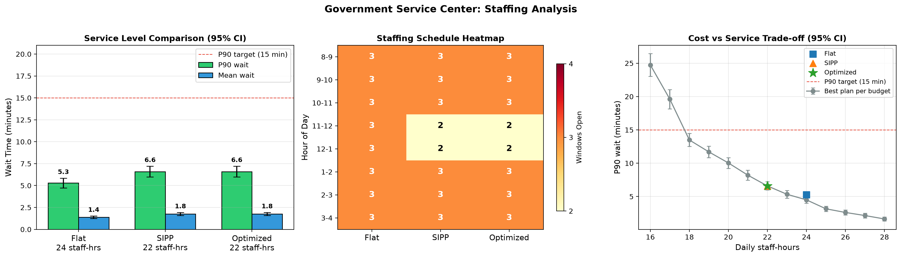

# Public-Sector Queue Resource Allocation Simulator

[](https://github.com/KassaSana/CivicQ/actions/workflows/ci.yml)

A discrete-event simulation (C++) coupled with parameter optimization (Python) to support staffing decisions at a government service center, plus an [interactive web visualizer](web/README.md) that runs the same model in the browser.

## Overview

This project models a municipal permit and licensing office with multiple identical service windows and time-varying citizen demand. It enables decision-makers to balance wait-time targets against labor costs through quantitative analysis.

### Why This Matters
- Citizens experience long, unpredictable wait times during peak periods
- Managers lack quantitative tools to justify staffing requests
- Over-staffing wastes taxpayer funds; under-staffing degrades public trust
- Decision support enables data-driven workforce planning and service-level agreements

## System Model

| Component | Specification |
|-----------|---------------|
| **Entities** | Citizens (arrivals), Service Windows (servers) |
| **Resources** | N service windows, each staffed or unstaffed per time slot |
| **Arrival Process** | Non-homogeneous Poisson process; λ(t) varies by hour |
| **Service Process** | Exponential service times; mean 1/μ = 8 minutes |
| **Queue Discipline** | Single FIFO queue feeding all open windows |
| **Time Horizon** | One 8-hour operating day; doors close at 480 minutes |

### Key Assumptions
- Walk-ins only by default. Appointments are optional (`--appointments`, `--no-show`, `--punctuality-sd`); booked citizens join the same FIFO queue.
- No balking/reneging (citizens wait indefinitely)
- All service windows are identical
- Citizens are served to completion
- **Closing time:** no one enters after 480 minutes, but everyone already inside is served. The time needed to clear the queue is reported as *overtime*.
- **Staffing changes on the hour:** windows that open at a slot boundary immediately serve the queue. A window that closes finishes its current citizen first. Because of that, utilization in the slot right after a staffing cut can slightly exceed 1.

## Mathematical Model

**Decision Variables:** Number of open windows per hourly slot: **s** = (s₁, s₂, ..., s₈) where sᵢ ∈ {2, 3, 4} and Σsᵢ ≤ 28.

The lower bound is 2 because the offered load λᵢ/μ is 1.07–2.0 in every hour, so a single window is unstable in all slots. That leaves 6,404 feasible plans.

**Objective Function:** Minimize weighted cost:
```
Cost = w₁ · W̄ + w₂ · Σsᵢ
```
where W̄ = mean wait time, and w₁, w₂ are policy weights (defaults 1.0 and 0.5). The optimized scenario adds the constraint that the mean 90th-percentile wait is at most 15 minutes.

**Performance Metrics:**
- Mean wait time
- 90th-percentile wait time (nearest-rank)
- Throughput (citizens served)
- Window utilization per slot
- Overtime (minutes past closing to serve everyone inside)

## Project Structure

```
CivicQ/
├── cpp/
│   ├── CMakeLists.txt
│   ├── include/
│   │   └── simulation.hpp
│   └── src/
│       ├── simulation.cpp
│       └── main.cpp
├── python/
│   ├── optimizer.py
│   ├── roster.py
│   └── test_validation.py
├── research/            # Staffing-methods study (REPORT.md, experiments, figures)
├── web/                 # Interactive visualizer (TypeScript port of the simulator)
├── outputs/
│   └── staffing_analysis.png
└── README.md
```

## Building the C++ Simulator

### Requirements
- A C++17 compiler (MSVC, GCC, or Clang)
- CMake 3.16+ (optional for MinGW)

### Windows (MinGW/g++)
```powershell
cd cpp
mkdir build
g++ -std=c++17 -O2 -Wall -static -Iinclude -o build/queue_sim.exe src/simulation.cpp src/main.cpp
```
`-static` bundles the MinGW runtime, so the executable runs without MinGW on `PATH`.

### Windows (MSVC with CMake)
```powershell
cmake -S cpp -B cpp/build
cmake --build cpp/build --config Release
```
The executable is written to `cpp/build/Release/queue_sim.exe`. The optimizer checks there automatically.

### Linux/macOS
```bash
cmake -S cpp -B cpp/build -DCMAKE_BUILD_TYPE=Release
cmake --build cpp/build
```

## Using the C++ Simulator

```bash
# Basic usage with defaults
./queue_sim

# Custom staffing (8 hourly slots)
./queue_sim --staffing 2,3,3,2,2,3,3,2

# Custom arrival rates (citizens per hour)
./queue_sim --arrivals 6,8,5,4,4,6,7,5

# Multiple replications for statistical validity
./queue_sim --replications 30 --seed 42

# One CSV row per replication (used by the optimizer for confidence intervals)
./queue_sim --replications 30 --per-replication

# Full options
./queue_sim --help
```

### Output Format
CSV averaged over replications:
```
metric,value
mean_wait_time,3.76779
p90_wait_time,13.4909
avg_served,90.2
avg_arrived,90.2
avg_overtime,11.2267
replications,30
utilization_slot_0,0.573644
...
```
With `--per-replication`, the output has one row per run with the columns `rep,mean_wait,p90_wait,served,arrived,overtime,util_0..util_7`.

## Results Chart



Generated by `python python/optimizer.py --scenario-analysis --frontier --save-plot outputs/staffing_analysis.png`.


## Python Optimizer

### Requirements
- Python 3.10+
- No external packages required (standard library only)
- Optional for plotting: matplotlib (`pip install matplotlib`)

### Running Scenario Analysis
```bash
cd python
python optimizer.py --scenario-analysis
# With visualization (requires matplotlib)
python optimizer.py --scenario-analysis --plot
# Add the staff-hours vs P90 trade-off table and chart panel
python optimizer.py --scenario-analysis --frontier --save-plot ../outputs/staffing_analysis.png
```
Use `--simulator PATH` if the executable is somewhere other than `cpp/build`. A full scenario analysis, including the exhaustive search, stress test, and trade-off curve, takes under a minute on a typical laptop.

### Running Grid Search Optimization
```bash
python optimizer.py --optimize --p90-target 15 --frontier --export results.csv
# Faster, approximate: evaluate a random sample of plans
python optimizer.py --optimize --sample-size 500
```

### Programmatic Usage
```python
from optimizer import (run_simulation, grid_search_optimize, run_scenario_analysis,
                       sipp_staffing, stress_test, pareto_frontier)

# Single simulation
result = run_simulation(staffing=[2, 3, 2, 2, 2, 3, 3, 2])
print(f"Mean wait: {result.mean_wait:.1f} min")

# Textbook per-hour Erlang-C staffing
print(sipp_staffing())

# Full scenario comparison (also returns every screened plan)
scenarios, all_results = run_scenario_analysis()

# P90 if demand runs 10% / 20% above forecast
stress = stress_test(scenarios['optimized'].staffing, factors=(1.1, 1.2))

# Best P90 for each staff-hour budget
frontier = pareto_frontier(all_results, known=list(scenarios.values()))

# Grid search with constraint
best, all_results = grid_search_optimize(
    wait_weight=1.0,
    staff_weight=0.5,
    p90_target=15.0  # Max 15-minute P90 wait
)
```

## Scenario Analysis

The optimizer compares three staffing policies:

| Scenario | Description |
|----------|-------------|
| **A. Flat** | Uniform staffing (3 windows all slots) |
| **B. SIPP / Erlang-C** | Each hour is treated as its own steady-state M/M/c queue, using the fewest windows with P(wait > 15 min) ≤ 10% (the textbook "stationary independent period-by-period" method) |
| **C. Optimized** | Cost-minimized under the 15-minute P90 constraint, found by simulation |

### Example Output
Real output from `python optimizer.py --scenario-analysis`, with default arrival rates, 300 replications, and seeds 42–341:
```
[A] Flat Staffing (3 windows/slot)
    Staffing: [3, 3, 3, 3, 3, 3, 3, 3]
    Mean wait: 1.39 min  (95% CI: 1.24-1.53)
    P90 wait:  5.29 min  (95% CI: 4.74-5.85)
    Staff-hours: 24  |  Overtime: 8.6 min  |  n=300 replications

[B] SIPP / Erlang-C (steady-state P90 <= 15 min each hour)
    Staffing: [3, 3, 3, 2, 2, 3, 3, 3]
    Mean wait: 1.77 min  (95% CI: 1.59-1.94)
    P90 wait:  6.59 min  (95% CI: 5.97-7.21)
    Staff-hours: 22  |  Overtime: 8.6 min  |  n=300 replications

[C] Optimized (P90 <= 15 min target)
    Staffing: [3, 3, 3, 2, 2, 3, 3, 2]
    Mean wait: 2.24 min  (95% CI: 2.03-2.45)
    P90 wait:  8.20 min  (95% CI: 7.45-8.95)
    Staff-hours: 21  |  Overtime: 11.9 min  |  n=300 replications

============================================================
ROBUSTNESS: P90 wait (min) if demand differs from forecast
============================================================
  Scenario      90% demand   100% demand   110% demand   120% demand
  Flat              3.8 ok        5.3 ok        6.9 ok        9.1 ok
  Sipp              4.8 ok        6.6 ok        8.4 ok       10.9 ok
  Optimized         6.1 ok        8.2 ok       10.7 ok       13.6 ok

>>> RECOMMENDATION:
    Adopt optimized staffing schedule: [3, 3, 3, 2, 2, 3, 3, 2]
    Peak staffing periods: 8-9AM, 9-10AM, 10-11AM, 1-2PM, 2-3PM
    Expected P90 wait: 8.2 minutes (95% CI 7.5-8.9)
    Total daily staff-hours: 21
    Statistically tied: [3, 3, 2, 2, 2, 3, 3, 2] (20 h, cost +0.03, 95% CI -0.07 to +0.12)
    Statistically tied: [2, 3, 3, 2, 2, 3, 3, 2] (20 h, cost +0.10, 95% CI -0.00 to +0.19)
    Statistically tied: [3, 3, 2, 2, 2, 3, 3, 3] (21 h, cost +0.05, 95% CI -0.07 to +0.18)
    Statistically tied: [2, 4, 2, 2, 2, 3, 3, 2] (20 h, cost +0.02, 95% CI -0.09 to +0.13)
    Statistically tied: [2, 3, 3, 2, 2, 3, 3, 3] (21 h, cost +0.12, 95% CI -0.00 to +0.25)
    Meets the P90 target up to 120% of forecast demand
```

### Reading the Results
- **The best plan uses 20 or 21 staff-hours, and six plans are tied.** With the default weights (1 per minute of mean wait, 0.5 per staff-hour), the cost curve is flat there: an extra staff-hour cuts mean wait by about 0.5–0.6 minutes, almost exactly its 0.5 price. The optimizer reports every finalist whose paired 95% CI on the cost difference includes zero, so read the output as "any of these". To choose among them:
  - pick a 20-hour plan to save labor;
  - pick the 21-hour plan to protect against busier-than-forecast days. It still meets the target at +20% demand, where the 20-hour plans do not.
- **Staffing should lag demand.** Demand falls at 10AM (15 → 10 citizens/hour), but the recommended plan keeps 3 windows until 11AM to clear the 9AM backlog. Per-hour formulas like SIPP can't see this carryover between hours (Green, Kolesar & Soares, 2001).
- **The trade-off:** relative to SIPP, the recommended plan saves 1 staff-hour per day for about 1.6 extra minutes of P90 wait (8.2 vs 6.6 min), well within the 15-minute target.
- **Forecast risk:** the recommended plan meets the target even with 20% more demand than forecast. Staffing to a single point forecast is a known weakness (Whitt, 2006), so the stress test is part of every scenario run.

### Cost vs Service Trade-off
The weighted cost picks among plans, but the real decision is how many staff-hours to fund. `--frontier` shows the best plan found for each budget. The top 10 plans per budget from screening are re-run with 300 replications, and the scenario plans compete too:

| Staff-hours | P90 wait (95% CI) | Mean wait | Staffing |
|---|---|---|---|
| 17 | 19.6 (18.2–21.0) | 6.6 | [2, 2, 2, 2, 2, 2, 3, 2] (misses target) |
| 18 | 13.5 (12.5–14.5) | 4.2 | [2, 3, 2, 2, 2, 2, 3, 2] |
| 19 | 11.7 (10.8–12.6) | 3.4 | [2, 3, 2, 2, 2, 3, 3, 2] |
| 20 | 10.0 (9.2–10.8) | 2.8 | [2, 3, 3, 2, 2, 3, 3, 2] |
| **21** | **8.2 (7.5–8.9)** | **2.2** | **[3, 3, 3, 2, 2, 3, 3, 2]** (optimized) |
| 22 | 6.6 (6.0–7.2) | 1.8 | [3, 3, 3, 2, 2, 3, 3, 3] (SIPP) |
| 24 | 4.5 (4.0–5.0) | 1.2 | [3, 4, 3, 2, 3, 3, 3, 3] |

18 staff-hours is the cheapest budget that meets the 15-minute target, with its whole CI below it. Under an hour-by-hour target (every hour at most 10% of arrivals waiting over 15 minutes), the answer is 21 ([research/REPORT.md](research/REPORT.md) §5.4).

An earlier version of this table used 30 replications. That gave CIs of ±4 minutes and wrongly showed the 18-hour plan missing the target (15.5 minutes). That version also shortlisted only 10 finalists, which missed the tied 21-hour optimum.

### Shift Rosters
Real staff work shifts, so the hourly plans above can't be staffed literally. `--shifts` recommends an actual roster. It searches over shift counts directly, judges every candidate by simulation, and re-checks the winner on an independent block of simulated days. This is the integrated search from [research/REPORT.md](research/REPORT.md) §5.5, which was up to 15% cheaper than turning an hourly plan into shifts.

```bash
python optimizer.py --shifts standard                  # full days (8-4) and 4-hour half days
python optimizer.py --shifts flexible                  # also 6-hour shifts
python optimizer.py --shifts flexible --target hourly  # every hour <= 10% of arrivals late
```

Real output:
```
SHIFT ROSTER (flexible menu)
============================================================
    Target: mean daily P90 <= 15 min (upper 95% bound)
    Roster: 2 x 8-4, 1 x 9-3
    Windows open by hour: [2, 3, 3, 3, 3, 3, 3, 2]
    Paid staff-hours: 22
    P90 wait: 9.4 min (95% CI 8.6-10.2)
    Late (> 15 min) by hour: 8 10%  9 6%  10 3%  11 1%  12 0%  1 2%  2 3%  3 13%
    Validated on 300 independent days
    Price of shifts: an hourly plan [2, 3, 2, 2, 2, 2, 3, 2] meets the same target with 18 window-hours; the roster pays +4 h (+22%)
```

- **Shift options change the answer.** With only full days and half days, the cheapest roster is 3 full days (24 paid hours). Half-day shifts can't cover both the 9AM and the 2PM peaks. A single 9–3 shift covers both, which saves 2 hours.
- **The "price of shifts" line** shows what hourly flexibility would be worth: 4 paid hours a day here.
- **The P90 target is a daily average.** This roster passes it, but its 8AM and 3PM hours are 10–13% late. Use `--target hourly` if every hour must meet the target. The report covers why the choice of target matters (§5.4).
- **Combining with scenario analysis.** `--scenario-analysis --shifts flexible` adds the roster after the scenario comparison.

## Technical Details

### Simulation Engine (C++)
- **Type:** Discrete-Event Simulation (DES)
- **Event Queue:** Priority queue (min-heap by time), with arrival, departure, and slot-boundary staffing events
- **Arrival Generation:** Thinning algorithm for non-homogeneous Poisson
- **Service Times:** Exponential, drawn when each citizen arrives
- **Reproducibility:** Deterministic given seed
- **Common random numbers:** arrivals and service times use separate random streams. With the same seed, every staffing plan sees the same citizens with the same service needs, so differences between plans reflect the staffing and not random noise (Atlason, Epelman & Henderson, 2008).

### Optimization (Python)
- **Method:** Two-stage exhaustive grid search
  1. Screen all 6,404 feasible plans with 10 replications each.
  2. Re-evaluate the 30 cheapest plans whose P90 confidence interval could meet the target, using 300 replications each, and pick the winner from those.
  3. Report every finalist whose paired 95% CI on the cost difference from the winner includes zero as statistically tied.
- **Statistical Handling:** 95% confidence intervals with Student-t critical values that match the number of replications
- **Performance:** all replications of a plan run in one simulator process, and plans are evaluated in parallel
- **Analytical baseline:** Erlang-C (M/M/c) formulas for the SIPP scenario
- **Robustness:** every scenario is re-simulated with arrival rates at 90–120% of forecast, on the same seeds. If the optimized plan misses the target, the single extra window that best restores it is reported.
- **Trade-off curve:** best P90 per staff-hour budget, re-simulated with 300 replications so noisy screening winners aren't reported as the best

## Validation

`python/test_validation.py` checks the simulator against queueing theory. With constant demand and staffing over a long horizon, the model reduces to a steady-state M/M/c queue. The simulated mean wait must then fall inside its 95% CI around the exact Erlang-C value:

| Case | Erlang-C Wq | Simulated (30 reps × 20,000 min) |
|------|-------------|----------------------------------|
| λ = 15/h, 3 windows (ρ = 0.67) | 3.56 min | 3.70 min (CI 3.48–3.93) |
| λ = 12/h, 2 windows (ρ = 0.80) | 14.22 min | 14.90 min (CI 13.74–16.06) |

The tests also check that:
- everyone inside at closing gets served
- windows opening at a slot boundary serve the existing queue
- common random numbers give identical arrivals across staffing plans
- the Erlang-C and confidence-interval helpers return correct values
- the trade-off curve keeps the best plan per budget, and the stress test at 100% demand reproduces the base run

```bash
python python/test_validation.py
```

## Research

[`research/REPORT.md`](research/REPORT.md) is a controlled study built on this simulator: **when do textbook staffing rules fail for walk-in public offices?** It compares SIPP, Lag-SIPP and offered-load staffing against simulation-based staffing across 24 office configurations. Main findings:
- The analytic rules never failed the service target, but overstaffed by 3.5–18.6% on average.
- Lag corrections recover about half of SIPP's excess.
- Daily demand uncertainty costs up to 22% more staff in large offices.
- The service-level definition alone moves this office's answer from 18 to 22 staff-hours.
- Real shifts (4h/8h) add 14-68% paid hours over an ideal hour-by-hour plan; searching over shift schedules with simulation is up to 15% cheaper than the textbook "hourly requirement, then shifts" method.
- Appointments cut the staffing need mainly through shifts: booking 75% of demand into quiet hours shrinks an 8-Erlang office's roster by 24%, but barely changes the hour-by-hour need.
- The simulator is cross-validated against the independent [Ciw](https://github.com/CiwPython/Ciw) library (0 of 54 tests reject).

The study also showed that 30 confirmation days gave P90 CIs of about ±4 minutes and misreported the 18-hour plan as missing the target. The optimizer now confirms with 300 days and reports statistical ties.

```bash
python research/experiments.py --all && python research/figures.py
```

## Web Visualizer

[`web/`](web/README.md) is a static React site. The simulator is ported to TypeScript and runs in a Web Worker, so you can edit the staffing plan, demand, service times and appointment share and see simulated and Erlang-C results update live. Its tests cross-check the port against the C++ executable.

```bash
cd web && npm install && npm run dev
```

## Scope Boundaries

**Intentionally Excluded:**
- Multiple service types / skill-based routing
- Balking / reneging behavior
- External datasets
- Metaheuristics (GA, SA)

**Constraints:**
- Grid search only (no external solvers)

## Future Work
- **Abandonment (Erlang-A).** Walk-in offices do lose citizens who give up. Modeling this needs a patience distribution calibrated on real walk-away data, and a separate "% abandoned" limit. Without those, abandonment shortens the queue and can hide understaffing.
- **Iterative Staffing Algorithm.** A simulation-based method for staffing time-varying queues to meet a time-stable service level (Feldman, Mandelbaum, Massey & Whitt, 2008).
- **Multiple service types.** Different transaction types with their own service times, as in the Virginia DMV staffing study.
- **Local search.** Replace the exhaustive search if the decision space grows, for example with more slots or larger offices.

## License

Public domain - developed for government R&D demonstration purposes.

## References

- Banks, J., Carson, J. S., Nelson, B. L., & Nicol, D. M. (2014). *Discrete-Event System Simulation*. Pearson.
- Law, A. M. (2015). *Simulation Modeling and Analysis*. McGraw-Hill.
- Green, L. V., Kolesar, P. J., & Soares, J. (2001). Improving the SIPP approach for staffing service systems that have cyclic demands. *Operations Research*, 49(4), 549–564.
- Green, L. V., Kolesar, P. J., & Whitt, W. (2007). Coping with time-varying demand when setting staffing requirements for a service system. *Production and Operations Management*, 16(1), 13–39.
- Atlason, J., Epelman, M. A., & Henderson, S. G. (2008). Optimizing call center staffing using simulation and analytic center cutting-plane methods. *Management Science*, 54(2), 295–309.
- Whitt, W. (2006). Staffing a call center with uncertain arrival rate and absenteeism. *Production and Operations Management*, 15(1), 88–102.
- Gans, N., Koole, G., & Mandelbaum, A. (2003). Telephone call centers: Tutorial, review, and research prospects. *Manufacturing & Service Operations Management*, 5(2), 79–141.
- Feldman, Z., Mandelbaum, A., Massey, W. A., & Whitt, W. (2008). Staffing of time-varying queues to achieve time-stable performance. *Management Science*, 54(2), 324–338.
