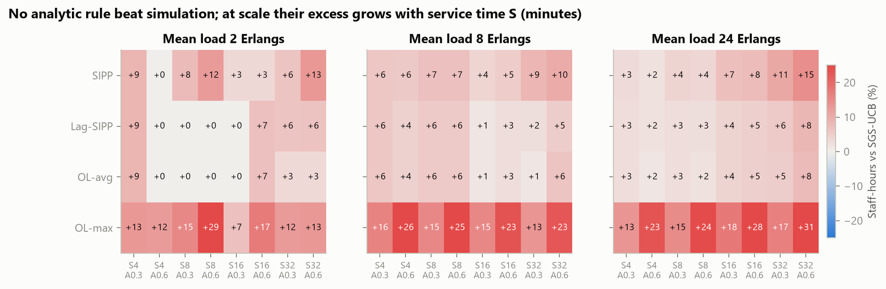
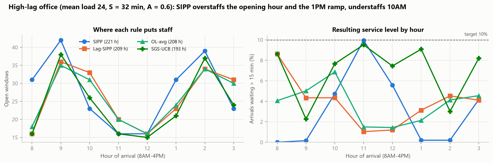
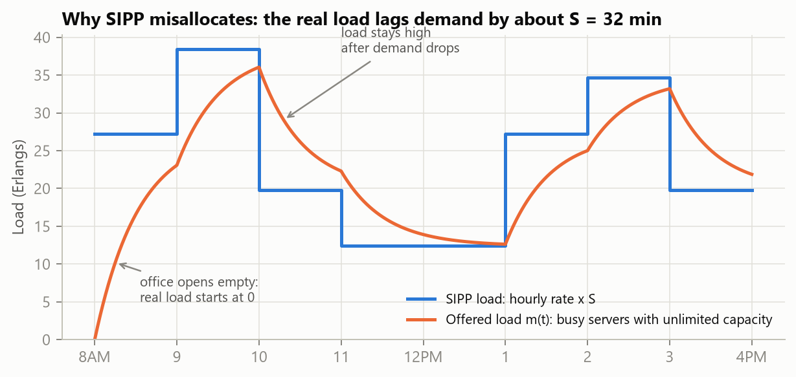
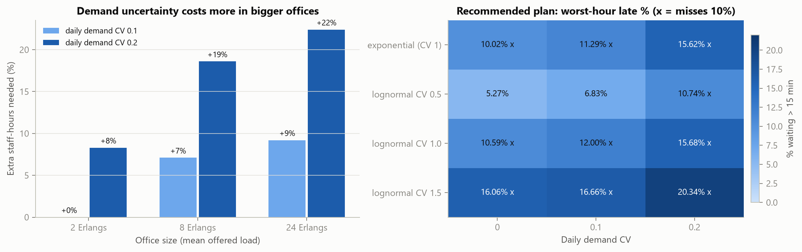
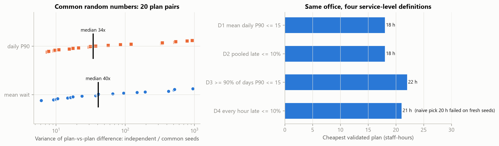

# Staffing Walk-In Public Offices: When Do Textbook Queueing Rules Fail?

*CivicQ research note. All numbers are regenerated by `python research/experiments.py --all` and `python research/figures.py` from fixed seeds.*

## Abstract

Government service centers staff their windows in hourly blocks using rules built for call centers. We ask how well those rules work under the conditions that make walk-in offices different. These offices are small, service times can be long compared with the one-hour planning block, the day starts with an empty queue, and at closing the doors shut while everyone inside is still served.

Using a validated discrete-event simulator, we compare four analytic rules with simulation-based staffing across a 24-setting factorial design:
- **SIPP**, the stationary independent period-by-period rule;
- **Lag-SIPP**;
- two offered-load rules (**OL-avg** and **OL-max**).

The target is that at most 10% of each hour's arrivals wait more than 15 minutes.

- **No analytic rule understaffed in a statistically significant way.** They are safe but wasteful. SIPP uses 6.7% more staff-hours than the simulation-based plan on average (up to 14.5%). Most of the excess sits in the opening hour and the early-afternoon ramp.
- **The lag corrections recover roughly half of SIPP's excess** when service takes 8 minutes or more, but little when it takes 4 minutes. Staffing to the peak offered load within each hour (OL-max) is the most wasteful rule, at +18.6%.
- **Demand uncertainty is a scale effect.** A 20% day-to-day uncertainty in demand costs +8% staff for a 2-window office and +22% for a 24-window office.
- **Two methodological results.** Common random numbers cut the variance of plan-vs-plan comparisons by a median of 40×. And the choice of service-level definition alone changes the required staffing for the same office from 18 to 22 staff-hours, which is a policy decision disguised as a technical one.

## 1. Background and gap

### Why SIPP is known to be inaccurate
SIPP treats each planning period as its own steady-state M/M/c queue. It is known to be inaccurate when:
- service times are long relative to the planning period,
- demand swings are large,
- or the periods are short.

The reason is that congestion lags demand (Green, Kolesar & Soares 2001; Green, Kolesar & Whitt 2007).

### Existing corrections
- **Lag-SIPP** shifts demand forward by about one mean service time.
- **Offered-load methods** replace the hourly rate with the infinite-server load m(t) (Jennings, Mandelbaum, Massey & Whitt 1996).
- **Simulation-based iterative staffing** targets the same performance in every period (Feldman, Mandelbaum, Massey & Whitt 2008).

### Empirical facts about real service systems
- Real service times are closer to lognormal than exponential (Brown et al. 2005).
- Arrival counts are often more variable than Poisson, because the daily rate is itself uncertain. Whether that uncertainty dominates depends on system size (Whitt 2006; Kim & Whitt 2014).

### The gap
Nearly all of this evidence comes from call centers: hundreds of agents, calls a few minutes long, and 15–30-minute periods. Walk-in public offices have:
- 2–25 windows,
- one-hour blocks,
- 4–30+ minute services,
- an empty start,
- a doors-close-but-finish-serving end.

These are the conditions under which the theory predicts SIPP is least reliable, and they have not been studied much. Public data such as the California DMV wait-time reports ([soodoku/wait](https://github.com/soodoku/wait)) contain hourly waits but not arrival counts, so we study the question through controlled simulation.

## 2. Model

A single FIFO queue feeds c(t) identical windows, where c(t) changes on the hour over an 8-hour day.
- **Arrivals** form a non-homogeneous Poisson process with hourly rates λᵢ. Optionally, each day's rates are multiplied by M ~ Gamma(mean 1, CV ρ), a gamma-mixed Poisson process.
- **Service** is exponential, lognormal (CV 0.5–1.5) or deterministic.
- **Staffing changes on the hour.** Windows that open at a boundary serve the queue immediately. A closing window finishes its current citizen.
- **Opening and closing.** The office opens empty. No one enters after 480 minutes, and everyone inside is served.
- **Service target.** P(W > 15 min | arrival in hour i) ≤ α = 0.10 for **every** hour i.

The simulator (C++) is validated against the exact Erlang-C mean wait and per-hour P(W > T) under constant load; see `python/test_validation.py` and `research/test_research.py`.

**Demand design.** λᵢ = (R̄/S)·(1 + A·zᵢ), where:
- z is the office's normalized double-peak profile (peaks at 9AM and 2PM),
- R̄ is the mean offered load in Erlangs,
- A is the demand swing.

## 3. Methods compared

| Method | Load fed to the per-hour Erlang-C P(W > 15) ≤ 0.10 calculation |
|---|---|
| **SIPP** | λᵢ·S |
| **Lag-SIPP** | S × the average of λ(t − S) over hour i (λ = 0 before opening) |
| **OL-avg** | average over hour i of the offered load m(t) = ∫₀ᵗ λ(t−u)·P(S>u) du |
| **OL-max** | maximum over hour i of m(t) |
| **SGS** | simulation greedy staffing. Start from SIPP and add a window to the earliest failing hour until every hour meets the target. Then run a local search over "remove one" and "remove two, add one" moves (400 design days, common random numbers). |
| **SGS-UCB** | the same, but a plan counts as feasible only if the **upper** 95% bound of every hour's late rate is ≤ 0.10 |

**Statistical protocol.**
- Plans are *chosen* on design seeds (1–400) and *scored* on a disjoint evaluation block (seeds 100000–100999, 1,000 days).
- Days, not citizens, are the independent unit. Per-hour late rates are ratio estimators with delta-method confidence intervals across days.
- A "significant miss" is an hour whose whole 95% CI lies above 10%.

## 4. Hypotheses (stated before running)

- **H1.** SIPP understaffs just after peaks and overstaffs the opening hour. Its error grows with S/60 and with A.
- **H2.** Lag-SIPP and offered-load rules close most of SIPP's gap for S ≤ 16 but not for S = 32.
- **H3.** For the studied office (S = 8, about 1.5 Erlangs), SIPP is within 1 staff-hour of the best plan.
- **H4.** 10% day-to-day demand uncertainty costs more staff than raising the service-time CV from 1.0 to 1.5.

## 5. Results

### 5.1 Is the simulation-based benchmark trustworthy? (E1b)
We searched exhaustively for any plan cheaper than SGS that meets the target, using per-hour lower bounds and all plans in between. SGS matched the optimum in **all 9 cases**: the studied office, plus 8 small-office settings covering every service time and demand swing.

At larger scales exhaustive search is not feasible. There, an early SGS version was caught in a local optimum: a stricter variant found a cheaper plan. That led us to add the "remove two, add one" move, after which the ordering was consistent everywhere.

Plain SGS is also slightly optimistic. Its plans had **significant** misses in 3 of 24 settings on fresh seeds (worst hour 11.7–12.2%), because a plan tuned to just pass on its design days carries selection bias. **SGS-UCB fixes this with zero significant misses, at a cost of +2.3% staff-hours.** SGS-UCB is therefore the reference for the remaining comparisons.

### 5.2 Analytic rules vs simulation (E1, 24 settings)



| Method | Mean staff-hours over SGS-UCB | Range | Settings with a significant miss |
|---|---|---|---|
| SIPP | **+6.7%** | 0 to +14.5% | 0 |
| Lag-SIPP | +3.9% | 0 to +8.7% | 0 |
| OL-avg | **+3.5%** | 0 to +8.7% | 0 |
| OL-max | +18.6% | +6.9 to +31.1% | 0 |
| SGS (point) | −2.3% | −6.9 to 0% | 3 |

Total SIPP excess (staff-hours summed over the 6 settings at each service time), and the share of it that the lag rules recover:

| Service time S | SIPP excess | Recovered by Lag-SIPP | Recovered by OL-avg |
|---|---|---|---|
| 4 min | 20 h | 10% | 15% |
| 8 min | 30 h | 40% | 43% |
| 16 min | 38 h | 42% | 42% |
| 32 min | 70 h | 47% | 53% |



**Where the error comes from.** Figures 2 and 3 show the mechanism:
- **The opening hour.** The office opens empty, so the real load m(t) starts at 0. SIPP staffs 8AM as if a queue had already built up. Summed over all 24 settings, SIPP put **101** more windows than SGS-UCB into the opening hour and **50** more into 1–2PM, when demand is rising but the queue has not yet built.
- **After peaks.** SIPP *does* understaff right after the peaks: −14 windows at 10AM, −8 at 11AM and −8 at 3PM, where load stays high although demand has dropped (10–11AM in Fig. 2). Those hours come close to the limit but never fail significantly.
- **The lag rules.** Lag-SIPP and OL-avg cut the opening excess to +21/+25 and the 1PM excess to +15/+18. But they over-correct after the peaks (+30/+24 at 10AM, +26/+22 at 3PM) and slightly understaff the peaks themselves (−15 at 2PM). That leftover misallocation is why they recover only about half of the gap.



**H1: partly supported, rejected as stated.**
- *Supported:* the predicted misallocation is real (overstaffing on rising demand, understaffing after peaks), and at scale SIPP's excess grows with S, from +3% to +15% at 24 Erlangs.
- *Rejected:* the net effect is **safe overstaffing, not service failures**. The effect of the demand swing A is small (+6.3% vs +7.1%).

**H2: rejected.** The corrections recover 40–53% of the excess at every S ≥ 8, including S = 32. They never recover "most" of it, and at S = 4 they recover little.

**H3: supported.** For the studied office, SIPP gives 22 staff-hours against a verified optimum of 21.

### 5.3 Sensitivity to model assumptions (E2, E2b)



**The office.** Service-time variability matters more than demand uncertainty.
- The office's current recommended plan (`[2,3,3,2,2,3,3,2]`, 20 h, from the cost-weighted optimizer) has its worst hour at 10.0% under exponential service, already on the limit.
- With lognormal service at CV 1.5 that rises to 16.1%. With 10% demand uncertainty it rises only to 11.3%.
- The staff-hours needed barely move (18–22 h across all 12 combinations) because staffing comes in whole windows.

**Across office sizes** (S = 8, A = 0.6), extra staff-hours needed for daily demand uncertainty:

| Office size | CV 0.1 | CV 0.2 |
|---|---|---|
| 2 Erlangs | +0% | +8% |
| 8 Erlangs | +7% | +19% |
| 24 Erlangs | +9% | +22% |

This fits the theory. Poisson noise grows like √λ, while noise from an uncertain daily rate grows like λ, so rate uncertainty dominates in large offices (Whitt 2006).

**H4: depends on scale.** It is false for the small office, where service variability dominates, and true from about 8 Erlangs up.

### 5.4 Methodology (E3)



**Common random numbers.** Across 20 random pairs of neighbouring plans, simulating both plans on the same seeds cut the variance of the difference in daily mean wait by a median of **40×** (range 6–940×), and in daily P90 by 34×. Without common random numbers, the exhaustive searches in this study would need roughly 40 times more simulated days for the same precision.

**The service-level definition is a policy choice.** Cheapest validated plan for the *same* office:

| Definition | Plan | Staff-hours | What it hides |
|---|---|---|---|
| D1: mean of daily P90 ≤ 15 min | [2,3,2,2,2,2,3,2] | 18 | 31% of days have a P90 above 15 min; three hours miss the per-hour target (10–11AM 15.1%, 1–2PM 12.3%, 3–4PM 10.8%) |
| D2: pooled late fraction ≤ 10% | [2,3,2,2,2,2,3,2] | 18 | same as D1 |
| D4: every hour ≤ 10% late | [2,4,2,2,2,3,3,3] | 21 | — |
| D3: ≥ 90% of days have P90 ≤ 15 | [3,3,3,2,2,3,3,3] | 22 | — |

**Selection bias.** Under D4, the cheapest plan in a 6,561-plan screen (20 h) **failed** on fresh seeds. Picking the minimum of thousands of noisy estimates favours lucky plans. After requiring each pick to also pass on an independent validation block (seeds 200000+), 3 candidates were rejected and the validated plan uses 21 h, which is the same staff-hours SGS found independently (the hour-by-hour split differs slightly).

**Implication for CivicQ's own optimizer.** `python/optimizer.py` confirms its finalists with 30 days. That is too few: the 18 h plan's mean daily P90 is 13.4 min (1,000 days, CI 12.9–14.0), but it measured 15.5 on its 30 confirmation days (CI 11.0–20.0), so the optimizer rejected it and recommended 20 h.

## 6. Threats to validity
- **Synthetic demand.** Arrival rates follow a stylized double-peak profile. There are no public arrival-count data for walk-in offices; the CA DMV data contain only waits.
- **Exponential service in E1.** This favours the Erlang-C rules, which assume it. With CV < 1, as is typical for lognormal service, the analytic rules would overstaff even more (E2).
- **Fixed service threshold.** T = 15 min is the same for every S. The same target is harder to meet with S = 32 than with S = 4.
- **Fixed schedule structure.** One-hour blocks only. No shift constraints, breaks, abandonment, appointments or multiple service types.
- **SGS optimality** is shown only for small instances, and relies on the monotonicity assumption used to derive the lower bounds.
- **Rate uncertainty** is modelled as a single daily multiplier. Correlated within-day forecast errors could matter more.

## 7. Practical guidance
1. **Staff to the queue, not to the demand.** Use offered-load (OL-avg) or Lag-SIPP rather than SIPP. It is free and recovers about half of SIPP's excess when service takes 8 minutes or more.
2. **Don't staff each hour to its peak load (OL-max).** It wastes about 19% of staff-hours on average.
3. **Plan the first hour separately.** An office that opens with no queue needs fewer windows in its first hour than any steady-state formula suggests.
4. **Validate by simulation with enough days** (hundreds, not 30), with common random numbers, and on seeds separate from the ones used to design the plan.
5. **Choose the service-level definition deliberately.** It moves the answer by more than any modelling refinement studied here.
6. **For larger offices, measure how much daily demand varies.** At 20% day-to-day variation it costs 19–22% more staff.

## 8. Reproducing
```bash
g++ -std=c++17 -O2 -static -Icpp/include -o cpp/build/queue_sim.exe cpp/src/simulation.cpp cpp/src/main.cpp
python research/test_research.py
python research/experiments.py --all     # about 15 minutes on 8 cores
python research/figures.py
```

## References
- Brown, L., Gans, N., Mandelbaum, A., Sakov, A., Shen, H., Zeltyn, S., & Zhao, L. (2005). Statistical analysis of a telephone call center: A queueing-science perspective. *JASA*, 100(469), 36–50.
- Feldman, Z., Mandelbaum, A., Massey, W. A., & Whitt, W. (2008). Staffing of time-varying queues to achieve time-stable performance. *Management Science*, 54(2), 324–338.
- Green, L. V., Kolesar, P. J., & Soares, J. (2001). Improving the SIPP approach for staffing service systems that have cyclic demands. *Operations Research*, 49(4), 549–564.
- Green, L. V., Kolesar, P. J., & Whitt, W. (2007). Coping with time-varying demand when setting staffing requirements for a service system. *Production and Operations Management*, 16(1), 13–39.
- Jennings, O. B., Mandelbaum, A., Massey, W. A., & Whitt, W. (1996). Server staffing to meet time-varying demand. *Management Science*, 42(10), 1383–1394.
- Kim, S.-H., & Whitt, W. (2014). Are call center and hospital arrivals well modeled by nonhomogeneous Poisson processes? *M&SOM*, 16(3), 464–480.
- Whitt, W. (2006). Staffing a call center with uncertain arrival rate and absenteeism. *Production and Operations Management*, 15(1), 88–102.
