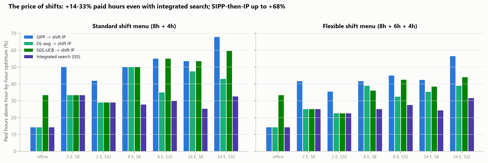
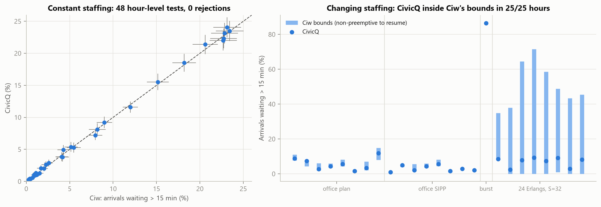
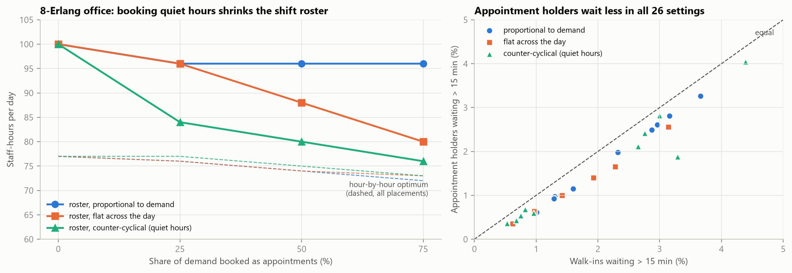
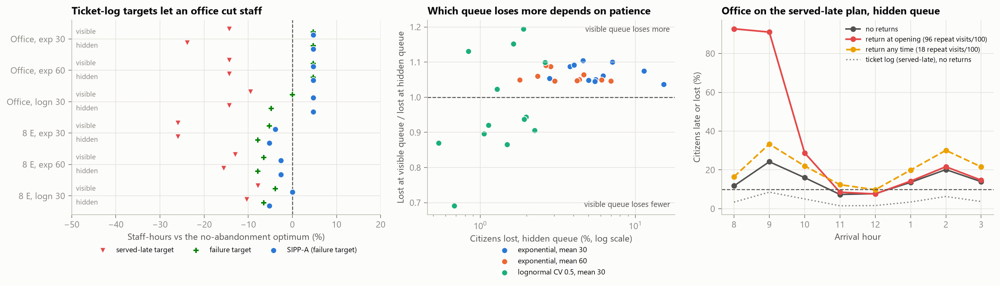
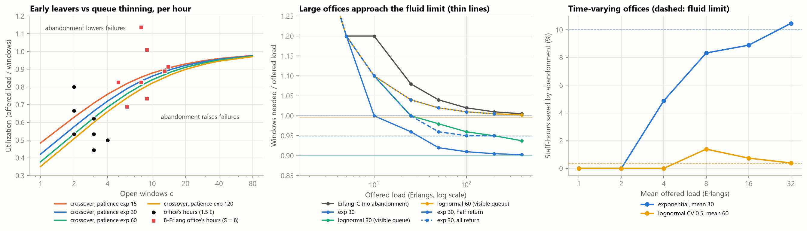
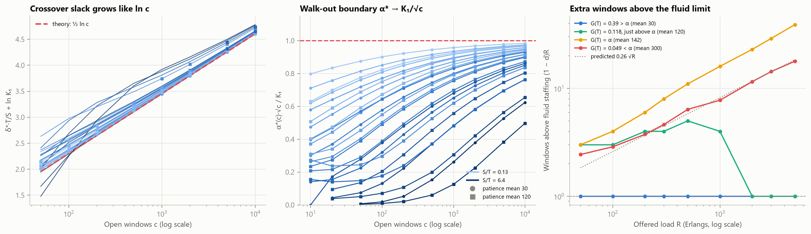

# Staffing Walk-In Public Offices: When Do Textbook Queueing Rules Fail?

*CivicQ research note. All numbers are regenerated by `python research/experiments.py --all` and `python research/figures.py` from fixed seeds.*

## Abstract

Government service centers staff their windows in hourly blocks using rules built for call centers. We ask how well those rules work under the conditions that make walk-in offices different. These offices are small, service times can be long compared with the one-hour planning block, the day starts with an empty queue, and at closing the doors shut while everyone inside is still served.

Using a validated discrete-event simulator, we compare four analytic rules with simulation-based staffing across a 24-setting factorial design:
- **SIPP**, the stationary independent period-by-period rule;
- **Lag-SIPP**;
- two offered-load rules (**OL-avg** and **OL-max**).

The target is that at most 10% of each hour's arrivals wait more than 15 minutes.

- **No analytic rule understaffed in a statistically significant way.** They are safe but wasteful. SIPP uses 6.7% more staff-hours than the simulation-based plan on average (up to 14.5%). Most of the excess sits in the opening hour and the early-afternoon ramp.
- **The lag corrections recover roughly half of SIPP's excess** when service takes 8 minutes or more, but little when it takes 4 minutes. Staffing to the peak offered load within each hour (OL-max) is the most wasteful rule, at +18.6%.
- **Demand uncertainty is a scale effect.** A 20% day-to-day uncertainty in demand costs +8% staff for a 2-window office and +22% for a 24-window office.
- **Two methodological results.** Common random numbers cut the variance of plan-vs-plan comparisons by a median of 40×. And the choice of service-level definition alone changes the required staffing for the same office from 18 to 22 staff-hours, which is a policy decision disguised as a technical one.
- **Shifts matter more than the staffing rule (Round 2).** Real staff work 4- and 8-hour shifts. The textbook two-step method (set an hourly requirement, then choose shifts with an integer program) costs up to **68%** more paid hours than the ideal hour-by-hour plan. Searching over shift schedules directly with simulation cuts that to **14–33%**, and is up to **15%** cheaper than the best two-step schedule. Unlike the call-center finding of Ingolfsson et al. (2002), two-step schedules here never miss the target: they are safe but expensive.
- **Appointments save staff through shifts, not hours (Round 3).** Moving demand to appointments barely changes the hour-by-hour staffing need: at most −6.5% even with 75% of demand booked. But booked into the quiet hours, appointments flatten demand enough for full-day shifts to fit it. That cut an 8-Erlang office's roster from 100 to 76 paid hours (−24%), against −4% when bookings follow the demand curve. A small office saw no change. Appointment holders waited less than walk-ins in every setting.
- **A served-citizens metric rewards understaffing (Round 4).** When walk-ins can leave, the usual ticket-log metric (the late share of *served* citizens) is met with 18–27% fewer staff-hours than the citizen view (late *or* left), while 11–19% of the busiest hour's arrivals walk out. If leavers must come back for a mandatory service, those savings become repeat visits: 18 per 100 transactions in the office, and at 8 Erlangs a plan below the raw workload that collapses. Returners who "come back first thing" swamp the opening hour. Whether a visible line loses more citizens than a hidden ticket queue depends on the shape of patience, as a Jensen argument predicts, but the visible line always has the higher failure rate. Erlang-A staffing was safe except where its exponential-patience assumption failed.
- **When leaving helps and when it hurts (Round 5).** Abandonment lowers the staffing need only if the target is lenient relative to the office's size. At fixed staffing it raises the failure rate below a crossover utilization ρ\*(c) and lowers it above. A strict 2% target makes abandonment cost 12–15% more staff; a 20% target saves up to 16%. For large offices a fluid limit predicts the saving as min(α, G(T)) of the load, where G is the patience CDF: 10.5% measured at 32 Erlangs against 10% predicted, and 0.4% against 0.35% for patient citizens. With mandatory returns the saving is exactly zero.
- **Large offices with a fixed threshold (Round 6).** Exact models up to 10,000 windows correct Round 5's scaling. The crossover slack grows like (S/2T)·ln c, not like √c. Abandonment can raise a large office's staffing only when the target α is below K₁/√c, a closed form that does not depend on the threshold. How fast the fluid saving is reached depends on where α sits against G(T): within one window above it, O(√R) extra windows below it, and O(√(R ln R)) exactly at it. Convergence is slow for patient citizens facing short thresholds, where two of the pre-registered tolerances failed.
- **Independent validation (Round 2).** An independent implementation in the open-source Ciw library agrees with CivicQ: 0 of 54 tests reject under constant staffing, and CivicQ stays within Ciw's bounds in all 25 hours tested under changing staffing. Along the way we found that Ciw's hourly schedules silently add overtime capacity at every shift boundary, which halves the measured lateness if used naively.

## 1. Background and gap

### Why SIPP is known to be inaccurate
SIPP treats each planning period as its own steady-state M/M/c queue. It is known to be inaccurate when:
- service times are long relative to the planning period,
- demand swings are large,
- or the periods are short.

The reason is that congestion lags demand (Green, Kolesar & Soares 2001; Green, Kolesar & Whitt 2007).

### Existing corrections
- **Lag-SIPP** shifts demand forward by about one mean service time.
- **Offered-load methods** replace the hourly rate with the infinite-server load m(t) (Jennings, Mandelbaum, Massey & Whitt 1996).
- **Simulation-based iterative staffing** targets the same performance in every period (Feldman, Mandelbaum, Massey & Whitt 2008).

### Empirical facts about real service systems
- Real service times are closer to lognormal than exponential (Brown et al. 2005).
- Arrival counts are often more variable than Poisson, because the daily rate is itself uncertain. Whether that uncertainty dominates depends on system size (Whitt 2006; Kim & Whitt 2014).

### The gap
Nearly all of this evidence comes from call centers: hundreds of agents, calls a few minutes long, and 15–30-minute periods. Walk-in public offices have:
- 2–25 windows,
- one-hour blocks,
- 4–30+ minute services,
- an empty start,
- a doors-close-but-finish-serving end.

These are the conditions under which the theory predicts SIPP is least reliable, and they have not been studied much. Public data such as the California DMV wait-time reports ([soodoku/wait](https://github.com/soodoku/wait)) contain hourly waits but not arrival counts, so we study the question through controlled simulation.

## 2. Model

A single FIFO queue feeds c(t) identical windows, where c(t) changes on the hour over an 8-hour day.
- **Arrivals** form a non-homogeneous Poisson process with hourly rates λᵢ. Optionally, each day's rates are multiplied by M ~ Gamma(mean 1, CV ρ), a gamma-mixed Poisson process.
- **Service** is exponential, lognormal (CV 0.5–1.5) or deterministic.
- **Staffing changes on the hour.** Windows that open at a boundary serve the queue immediately. A closing window finishes its current citizen.
- **Opening and closing.** The office opens empty. No one enters after 480 minutes, and everyone inside is served.
- **Service target.** P(W > 15 min | arrival in hour i) ≤ α = 0.10 for **every** hour i.

The simulator (C++) is validated against the exact Erlang-C mean wait and per-hour P(W > T) under constant load; see `python/test_validation.py` and `research/test_research.py`.

**Demand design.** λᵢ = (R̄/S)·(1 + A·zᵢ), where:
- z is the office's normalized double-peak profile (peaks at 9AM and 2PM),
- R̄ is the mean offered load in Erlangs,
- A is the demand swing.

## 3. Methods compared

| Method | Load fed to the per-hour Erlang-C P(W > 15) ≤ 0.10 calculation |
|---|---|
| **SIPP** | λᵢ·S |
| **Lag-SIPP** | S × the average of λ(t − S) over hour i (λ = 0 before opening) |
| **OL-avg** | average over hour i of the offered load m(t) = ∫₀ᵗ λ(t−u)·P(S>u) du |
| **OL-max** | maximum over hour i of m(t) |
| **SGS** | simulation greedy staffing. Start from SIPP and add a window to the earliest failing hour until every hour meets the target. Then run a local search over "remove one" and "remove two, add one" moves (400 design days, common random numbers). |
| **SGS-UCB** | the same, but a plan counts as feasible only if the **upper** 95% bound of every hour's late rate is ≤ 0.10 |

**Statistical protocol.**
- Plans are *chosen* on design seeds (1–400) and *scored* on a disjoint evaluation block (seeds 100000–100999, 1,000 days).
- Days, not citizens, are the independent unit. Per-hour late rates are ratio estimators with delta-method confidence intervals across days.
- A "significant miss" is an hour whose whole 95% CI lies above 10%.

## 4. Hypotheses (stated before running)

- **H1.** SIPP understaffs just after peaks and overstaffs the opening hour. Its error grows with S/60 and with A.
- **H2.** Lag-SIPP and offered-load rules close most of SIPP's gap for S ≤ 16 but not for S = 32.
- **H3.** For the studied office (S = 8, about 1.5 Erlangs), SIPP is within 1 staff-hour of the best plan.
- **H4.** 10% day-to-day demand uncertainty costs more staff than raising the service-time CV from 1.0 to 1.5.

**Round 2** (stated before running E4 and E5):
- **H5.** Integrated simulation search over shift schedules is at least 5% cheaper than the best two-step schedule when service is long (S = 32).
- **H6.** Unlike the call-center finding of Ingolfsson et al. (2002), SIPP-then-IP schedules do not miss the per-hour target in walk-in settings, because SIPP overstaffs. They cost more instead.
- **H7.** CivicQ and an independent simulator (Ciw) give statistically indistinguishable per-hour late rates.

**Round 3** (stated before running E6):
- **H8.** Converting demand to appointments saves staff mainly by smoothing demand. Counter-cyclical placement (booking the quiet hours) saves clearly more than placement proportional to demand.
- **H9.** With 15% no-shows and walk-ins still present, a small office (about 1.5 Erlangs) saves less than 10% of roster paid hours, even with half of demand booked.
- **H10.** Under FIFO, appointment holders get *worse* late rates than walk-ins when placement is proportional, because they are booked into the peaks. Counter-cyclical placement reverses this.

**Round 4** (stated before running E7; informed only by the stationary per-hour models in `research/abandonment.py`, not by any simulation of the office):

Walk-ins may now leave. Two behaviours share one patience distribution. In a **hidden queue** (ticket number, no view of the line) a citizen *reneges* once their wait exceeds their patience. In a **visible queue** a citizen *balks*: they see q people waiting at c windows, expect to wait (q + 1)·S/c, and leave at once if that exceeds their patience. Two per-hour metrics are compared. The **served-late rate** (late / served) is what a ticket log of served citizens shows. The **failure rate** ((late + left) / everyone who came) is the citizen's view.

- **H11 (ticket-log illusion).** With mean patience 30 min, the cheapest plan meeting the per-hour target on the served-late rate uses at least 10% fewer staff-hours than the cheapest plan meeting it on the failure rate, in both offices and under both behaviours. It loses at least 5% of arrivals in its worst hour.
- **H12 (visible vs hidden queue).** For one citizen facing an uncertain wait V, a hidden queue loses them with probability E[F(V)], where F is the patience CDF. A visible queue loses them with probability F(estimate), and the estimate ignores people ahead who would have left. By Jensen's inequality, where F is concave (exponential patience) the visible queue loses **more** citizens at the same staffing. Where F is convex over typical waits (lognormal, CV 0.5, mode ≈ 21 min) the ordering may reverse. Prediction: with exponential patience the visible queue loses more citizens in ≥ 90% of plan × setting comparisons, and with lognormal patience it loses fewer in the majority.
- **H13 (mandatory services).** A citizen who leaves still needs the permit, so they return on a later day (probability r = 1). Prediction for the served-late-optimal plan (exponential patience, mean 30): at least 5 repeat visits per 100 transactions. If returners come at opening, the opening hour's failure rate rises by at least 5 points over the no-return case. The office's own ticket log still shows the target met in every hour, so the office could not detect the problem from its own data.
- **H14 (analytic rule under abandonment).** Per-hour SIPP built on the stationary abandonment models (Erlang-A for reneging, the balking chain for balking) meets the failure target with no significant misses in every setting.

**Round 5** (stated before running E8b; derived from the stationary models and a fluid argument, §5.9). Round 4 found that abandonment raised the small office's staffing need but cut the 8-Erlang office's. The stationary analysis attributes this to two regimes. At a fixed number of windows, abandonment lowers the failure rate only above a crossover utilization ρ\*(c), which rises toward 1 with c. Below it, early leavers outweigh queue thinning. Abandonment can raise the requirement only when the target α is stricter than the Erlang-C late rate at that crossover, α\*(c), which falls from 0.14 at c = 1 to 0.02 at c = 80. For large offices a fluid limit gives the saving as a share of the offered load: d = min(α, G(T)), where G is the patience CDF. With a return probability r it becomes d(1 − r)/(1 − rd), which is zero for mandatory services.

- **H15 (the saving grows with size toward the fluid limit).** Time-varying offices (S = 8, A = 0.6), hidden queue, α = 0.10. With exponential patience (mean 30), the staff-hour saving of the failure-target plan over the no-abandonment plan grows with mean load from 1 to 32 Erlangs and lies within 6–14% at 32 Erlangs. With lognormal patience (mean 60, CV 0.5; G(15) = 0.35%), the saving is at most 3% at every size.
- **H16 (a strict target reverses the sign).** At α = 0.02, abandonment (exponential, mean 30) **raises** the staff-hours needed in both the office and the 8-Erlang office. At α = 0.20 it lowers or leaves them unchanged in both.
- **H17 (small offices feel only the early leavers).** Many-server theory says a moderately loaded system depends on patience mainly through its density near zero (Zeltyn & Mandelbaum 2005). Prediction for the office's plan: exponential patience at means 30, 60 and 120 raises the worst hour's failure rate above its no-abandonment late rate. Lognormal patience (CV 0.5, density 0 at zero) at means 60 and 120 changes it by less than 1 point.
- **H18 (returns remove the discount).** In the stationary per-hour model with returns at probability r, staffing per unit of offered load converges to (1 − d)/(1 − rd) as load grows: 0.90, 0.947 and 1.00 for r = 0, 0.5 and 1 with exponential patience.

**Round 6** (stated before running E9; derived analytically below). §5.9 read the crossover as Halfin–Whitt scaling, 1 − ρ\* ≈ β\*/√c. But β\* kept falling with c, from 0.6 to 0.2. A re-reading of the published E8a table showed that the slack δ\* = c − R\* at the crossover grows like ln c instead, with a slope near S/(2T) for every patience level. We give a derivation, and then predictions tested only at window counts, service times, thresholds and patience levels that E8a did not cover.

*Derivation (hidden queue, exponential service mean S and patience mean θ⁻¹, threshold T fixed as c grows).*
- **Erlang-C side.** P(W > T) = C(c, R)·e^{−δT/S}. For this to reach a fixed small target, δ need only be O(log c). Then β = δ/√c → 0 and C → 1.
- **Erlang-A side, near critical load.** Write the number in system as c + √c·X. X is a diffusion with drift −X/S below zero (servers) and −θX above zero (abandonment), and infinitesimal variance 2/S.
  - Its stationary density is ∝ e^{−x²/2} for x < 0 and ∝ e^{−r²x²/2} for x > 0, where r = √(θS).
  - So P(wait) → 1/(1 + r) and E[Q] = √c·E[X⁺].
  - Hence P(abandon) = θE[Q]/λ → K₁/√c, with **K₁ = r·√(2/π)/(1 + r)**.
  - Waits are O(S/√c) ≪ T, so served-late citizens are exponentially rare, and the failure rate is ≈ K₁/√c.
- **Crossover.** Setting e^{−δT/S} = K₁/√c gives

  δ\*·T/S = ½ ln c − ln K₁(θS) + o(1),  and  α\*(c) = K₁(θS)/√c · (1 + o(1)).

  Convergence is slow, because the neglected terms are O(β\*) = O((S/T) ln c/√c).

*Order of the large-office correction.* Let x(R) = c_req − (1 − d)R be the extra windows above the fluid staffing of §5.9, with d = min(α, G(T)). The throughput identity λ(1 − P(ab)) = μ·E[busy] ≤ cμ gives P(ab) ≥ 1 − c/R, so x > 0 whenever d = α. In the fluid regime, the stationary queue fluctuates by √(λ/θ). Together with each citizen's own service randomness, that gives the wait a spread σ_w ≈ √(S(θ⁻¹ + T)/R) around its fluid value w\*, where G(w\*) = 1 − c/R.
- **G(T) > α.** w\* < T by a fixed margin, so late service is exponentially rare and idle windows are exponentially rare. One window above (1 − α)R suffices: **x ≤ 1**.
- **G(T) < α.** w\* sits at T. Late service must be held to α − G(T) by pushing w\* below T by z·σ_w, where z is the standard normal quantile at α − G(T). That costs **x ≈ z·g(T)·√(S(θ⁻¹ + T))·√R** windows, where g is the patience density.
- **G(T) = α.** Both constraints bind together, and x grows faster than √R, like √(R ln R).

*Hypotheses.*
- **H19 (logarithmic slack).** For S ∈ {4, 8, 16, 32}, T ∈ {5, 15, 30} and patience means 30 and 120 (exponential), the slope of δ\* against ln c, fitted over c = 1,000–10,000, lies within 10% of S/(2T) in every case where β\* < 0.15 at c = 10,000. For fixed θS, curves of δ\*·T/S against ln c for different T coincide within 0.1 at c ≥ 1,000: patience shifts the intercept, and S/T scales the whole curve.
- **H20 (the walk-out boundary falls like 1/√c and does not depend on T).** α\*(c)·√c rises monotonically toward K₁(θS) (0.272 for S = 8, mean 30; 0.164 for mean 120). At c = 10,000 it lies within 15% of K₁ in every case with β\* < 0.15. At that c, α\* differs by less than 15% across T = 5, 15 and 30 for the same S and patience. Abandonment can therefore raise the requirement of a large office only when α < K₁/√c, whatever the threshold.
- **H21 (three orders of the fluid correction).** Stationary per-hour failure-target staffing, hidden queue, S = 8, T = 15, α = 0.10, R from 50 to 5,000 Erlangs:
  - (a) exponential patience, mean 30 (G(T) = 0.39): x ∈ (0, 1] at every R ≥ 50;
  - (b) mean 300 (G(T) = 0.049): x/√R converges, and lies in 0.15–0.40 (predicted 0.26) at R ≥ 1,000;
  - (c) mean 142.4 (G(T) = α exactly): x/√R keeps rising from R = 300 to 5,000;
  - (d) mean 120 (G(T) = 0.1175, just above α): x > 1 up to R = 500, then falls back to x ≤ 1 by R = 5,000. The derivation places the turnover where the margin T − G⁻¹(α) = 2.4 min reaches about 3.5 σ_w, near R ≈ 2,000–3,000.

*Change after pre-registration (Round 2):* while testing H7 we found that Ciw cannot express CivicQ's staffing-change rule (see §5.6). H7 was therefore split into a strict test for constant staffing and a bounds test for changing staffing *before* E5 was run. This deviation is disclosed here.

## 5. Results

### 5.1 Is the simulation-based benchmark trustworthy? (E1b)
We searched exhaustively for any plan cheaper than SGS that meets the target, using per-hour lower bounds and all plans in between. SGS matched the optimum in **all 9 cases**: the studied office, plus 8 small-office settings covering every service time and demand swing.

At larger scales exhaustive search is not feasible. There, an early SGS version was caught in a local optimum: a stricter variant found a cheaper plan. That led us to add the "remove two, add one" move, after which the ordering was consistent everywhere.

Plain SGS is also slightly optimistic. Its plans had **significant** misses in 3 of 24 settings on fresh seeds (worst hour 11.7–12.2%), because a plan tuned to just pass on its design days carries selection bias. **SGS-UCB fixes this with zero significant misses, at a cost of +2.3% staff-hours.** SGS-UCB is therefore the reference for the remaining comparisons.

### 5.2 Analytic rules vs simulation (E1, 24 settings)


| Method | Mean staff-hours over SGS-UCB | Range | Settings with a significant miss |
|---|---|---|---|
| SIPP | **+6.7%** | 0 to +14.5% | 0 |
| Lag-SIPP | +3.9% | 0 to +8.7% | 0 |
| OL-avg | **+3.5%** | 0 to +8.7% | 0 |
| OL-max | +18.6% | +6.9 to +31.1% | 0 |
| SGS (point) | −2.3% | −6.9 to 0% | 3 |

Total SIPP excess (staff-hours summed over the 6 settings at each service time), and the share of it that the lag rules recover:

| Service time S | SIPP excess | Recovered by Lag-SIPP | Recovered by OL-avg |
|---|---|---|---|
| 4 min | 20 h | 10% | 15% |
| 8 min | 30 h | 40% | 43% |
| 16 min | 38 h | 42% | 42% |
| 32 min | 70 h | 47% | 53% |


**Where the error comes from.** Figures 2 and 3 show the mechanism:
- **The opening hour.** The office opens empty, so the real load m(t) starts at 0. SIPP staffs 8AM as if a queue had already built up. Summed over all 24 settings, SIPP put **101** more windows than SGS-UCB into the opening hour and **50** more into 1–2PM, when demand is rising but the queue has not yet built.
- **After peaks.** SIPP *does* understaff right after the peaks: −14 windows at 10AM, −8 at 11AM and −8 at 3PM, where load stays high although demand has dropped (10–11AM in Fig. 2). Those hours come close to the limit but never fail significantly.
- **The lag rules.** Lag-SIPP and OL-avg cut the opening excess to +21/+25 and the 1PM excess to +15/+18. But they over-correct after the peaks (+30/+24 at 10AM, +26/+22 at 3PM) and slightly understaff the peaks themselves (−15 at 2PM). That leftover misallocation is why they recover only about half of the gap.


**H1: partly supported, rejected as stated.**
- *Supported:* the predicted misallocation is real (overstaffing on rising demand, understaffing after peaks), and at scale SIPP's excess grows with S, from +3% to +15% at 24 Erlangs.
- *Rejected:* the net effect is **safe overstaffing, not service failures**. The effect of the demand swing A is small (+6.3% vs +7.1%).

**H2: rejected.** The corrections recover 40–53% of the excess at every S ≥ 8, including S = 32. They never recover "most" of it, and at S = 4 they recover little.

**H3: supported.** For the studied office, SIPP gives 22 staff-hours against a verified optimum of 21.

### 5.3 Sensitivity to model assumptions (E2, E2b)


**The office.** Service-time variability matters more than demand uncertainty.
- The 20 h plan `[2,3,3,2,2,3,3,2]` has its worst hour at 10.0% under exponential service, already on the limit. It was the optimizer's recommendation when these experiments ran, and it remains one of its statistically tied choices (§5.4).
- With lognormal service at CV 1.5 that rises to 16.1%. With 10% demand uncertainty it rises only to 11.3%.
- The staff-hours needed barely move (18–22 h across all 12 combinations) because staffing comes in whole windows.

**Across office sizes** (S = 8, A = 0.6), extra staff-hours needed for daily demand uncertainty:

| Office size | CV 0.1 | CV 0.2 |
|---|---|---|
| 2 Erlangs | +0% | +8% |
| 8 Erlangs | +7% | +19% |
| 24 Erlangs | +9% | +22% |

This fits the theory. Poisson noise grows like √λ, while noise from an uncertain daily rate grows like λ, so rate uncertainty dominates in large offices (Whitt 2006).

**H4: depends on scale.** It is false for the small office, where service variability dominates, and true from about 8 Erlangs up.

### 5.4 Methodology (E3)


**Common random numbers.** Across 20 random pairs of neighbouring plans, simulating both plans on the same seeds cut the variance of the difference in daily mean wait by a median of **40×** (range 6–940×), and in daily P90 by 34×. Without common random numbers, the exhaustive searches in this study would need roughly 40 times more simulated days for the same precision.

**The service-level definition is a policy choice.** Cheapest validated plan for the *same* office:

| Definition | Plan | Staff-hours | What it hides |
|---|---|---|---|
| D1: mean of daily P90 ≤ 15 min | [2,3,2,2,2,2,3,2] | 18 | 31% of days have a P90 above 15 min; three hours miss the per-hour target (10–11AM 15.1%, 1–2PM 12.3%, 3–4PM 10.8%) |
| D2: pooled late fraction ≤ 10% | [2,3,2,2,2,2,3,2] | 18 | same as D1 |
| D4: every hour ≤ 10% late | [2,4,2,2,2,3,3,3] | 21 | — |
| D3: ≥ 90% of days have P90 ≤ 15 | [3,3,3,2,2,3,3,3] | 22 | — |

**Selection bias.** Under D4, the cheapest plan in a 6,561-plan screen (20 h) **failed** on fresh seeds. Picking the minimum of thousands of noisy estimates favours lucky plans. After requiring each pick to also pass on an independent validation block (seeds 200000+), 3 candidates were rejected and the validated plan uses 21 h, which is the same staff-hours SGS found independently (the hour-by-hour split differs slightly).

**Implication for CivicQ's own optimizer.** `python/optimizer.py` used to confirm its finalists with 30 days. That made its *reported numbers* unreliable. The 18 h plan's mean daily P90 is 13.4 min (1,000 days, CI 12.9–14.0), but on its 30 confirmation days it measured 15.5 (CI 11.0–20.0), so the trade-off table showed it missing the target.

The recommendation itself was not an artifact of noise. The optimizer minimizes mean wait + 0.5 × staff-hours, and the 18 h plan loses on that cost at every sample size (13.17 vs 12.73 over 1,000 days).

Fixing the check exposed a subtler problem. Near the optimum the cost surface is flat: six 20–21 h plans lie within about 0.1 cost units, so a single "best" plan is arbitrary. A 10-plan shortlist had also missed the lowest-cost one. The optimizer now:
- confirms with 300 days;
- shortlists 30 finalists;
- reports every finalist whose paired 95% CI on the cost difference includes zero as statistically tied.

It currently recommends `[3,3,3,2,2,3,3,2]` (21 h), with five 20–21 h plans tied.

### 5.5 Shift-feasible staffing (E4)

Everything above assumed any number of windows in any hour. In reality staff work shifts. We compare two shift menus on 7 settings: the office, plus offices of 2, 8 and 24 Erlangs with S = 8 or 32 and A = 0.6.
- **Standard menu:** full days (8–4) and 4-hour half days starting at 8, 9, 10, 11 or 12.
- **Flexible menu:** the standard shifts plus 6-hour shifts.

Cost is paid hours.
- **Two-step** schedules convert an hourly requirement (from SIPP, OL-avg or SGS-UCB) into the cheapest covering shift set, using an exact integer program (`scipy.optimize.milp`).
- **Integrated search (ISS)** starts from the cheapest feasible two-step schedule and runs a local search directly over shift counts. Each candidate schedule is judged by simulation (SGS-UCB criterion, 400 design days). The moves are:
  - drop a shift;
  - swap a shift for a shorter or equal one;
  - replace two shifts with one.

  The flexible-menu search also starts from the standard-menu optimum; without that multi-start, local search once ended 2 h worse on the richer menu.

All numbers below are scored on the separate evaluation days.



| Setting | Hour-by-hour optimum (window-hours) | Standard: best two-step | Standard: ISS | Saving | Flexible: best two-step | Flexible: ISS | Saving |
|---|---|---|---|---|---|---|---|
| Office | 21 | 24 | 24 | 0% | 24 | 24 | 0% |
| 2 E, S8 | 24 | 32 | 32 | 0% | 30 | 30 | 0% |
| 2 E, S32 | 31 | 40 | 40 | 0% | 38 | 38 | 0% |
| 8 E, S8 | 72 | 108 | 92 | **14.8%** | 98 | 90 | 8.2% |
| 8 E, S32 | 80 | 108 | 104 | 3.7% | 106 | 102 | 3.8% |
| 24 E, S8 | 198 | 292 | 248 | **15.1%** | 268 | 246 | 8.2% |
| 24 E, S32 | 193 | 276 | 256 | 7.2% | 268 | 254 | 5.2% |

1. **The price of shifts is the largest effect in this study.**
   - Even the best schedule found costs 14–33% more paid hours than the hour-by-hour optimum.
   - SIPP-then-IP costs up to 68% more.
   - Demand peaks at 9AM and 2PM, and half-day shifts can't cover both peaks. So covering every hour's peak requirement leaves 68–115 surplus window-hours in the quiet midday hours at scale.
2. **Integrated search pays off in medium and large offices** (4–15%). In small ones (≤ 2 Erlangs) every method lands on the same few full-day shifts.
   - The mechanism is carryover. A schedule has surplus windows right after each peak anyway, and that surplus clears the peak's backlog. So the peak hours themselves can run leaner than their stand-alone requirement.
   - A per-hour requirement cannot see this. As a result, the per-hour-optimal requirement (SGS-UCB) often converts into *more* paid hours than the cruder OL-avg requirement.
3. **Better planning beats more shift types.** In offices of 8 Erlangs or more, the flexible menu helps two-step methods by up to 9% but integrated search by at most 2%. In the smallest offices it helps both equally (5–6%), since there is nothing to integrate. Integrated search on the *standard* menu (248 h at 24 E, S8) beats the best two-step schedule on the *flexible* menu (268 h).
4. **No two-step schedule missed the target significantly in any setting.** Their worst hour was at most 7% late, and at scale typically under 1%. This is the opposite of the call-center result.

**H5: rejected as stated.** The savings are real but are not driven by long service: 15% at S = 8 against 4–7% at S = 32. They grow with office size, because larger offices have more room to rearrange shifts.

**H6: supported.** SIPP-then-IP never missed. It cost 0–17% more than the best two-step schedule on the standard menu, and 14–68% more than the hour-by-hour optimum.

### 5.6 Independent validation against Ciw (E5)

We re-implemented the office model in [Ciw](https://github.com/CiwPython/Ciw) (Palmer et al. 2019), an independent open-source queueing simulator:
- arrivals from `PoissonIntervals`, which gives exact piecewise-constant Poisson arrivals;
- the same three service families;
- staffing from `Schedule`.

It passes the same Erlang-C check as CivicQ (a late rate of 0.066 ± 0.005 against a theoretical 0.068).

**A pitfall worth reporting.** Hourly shifts with an *unchanged* count initially halved Ciw's late rate: 0.106 against 0.228 for two windows at 11.1 arrivals/hour, where Erlang-C and CivicQ both give about 0.23. Ciw staffs every shift with a fresh set of servers, and without preemption the previous shift's busy servers finish their customers in overtime alongside them. That is documented behaviour, but it means splitting a schedule into hourly blocks silently adds capacity at every boundary. Merging consecutive equal shifts removes the artefact.

When the count really changes, CivicQ's closing window finishes its customer *as part of* the new count. Ciw cannot express that, but its two nearest options bracket it:
- no preemption adds overtime capacity, a lower bound on lateness;
- `resume` interrupts service, an upper bound.



- **Strict test (constant staffing, 6 cases, 2,000 independent days per simulator):** 48 per-hour late-rate comparisons and 6 mean-wait comparisons. **0 of 54 reject** at 5% before correction (about 2.7 expected by chance), and 0 after Holm correction. Mean waits agree within 1% (every |z| < 0.8). The cases include lognormal and deterministic service and a 31-window office.
- **Bounds test (changing staffing, 4 cases):** CivicQ lies inside Ciw's bounds in **25 of 25** hours. The bounds are tight for the office plans (median width 1–4 percentage points), so there the test is informative. For the 24-Erlang, S = 32 plan they are about 48 points wide, because long services interrupted at every staffing change inflate the upper bound. That case is only weakly tested.

**H7: supported** for constant staffing, and consistent within informative bounds for changing staffing.

### 5.7 Appointments mixed with walk-ins (E6)

A share f of expected daily demand moves to appointments. Walk-in rates become λᵢ(1 − f), and n = f·Λ/(1 − p) slots are booked, so no-shows (probability p) are offset by overbooking. That keeps expected arrivals constant and makes cells comparable. Booked citizens arrive at their slot time plus Normal(0, 5 min) and are served FIFO with walk-ins.

Placement options, for the expected shows per hour:
- *proportional*: the same shape as demand;
- *flat*: evenly across the day;
- *counter-cyclical*: water-filled into the quiet hours, so walk-ins plus shows are as flat as possible.

Within each hour, bookings are evenly spaced. Two offices are studied: the office (1.5 Erlangs, S = 8) and an 8-Erlang office with S = 16 and A = 0.6. For each cell we find:
- the hourly optimum (SGS-UCB);
- the standard-menu roster (integrated search from the fewest feasible full-day shifts, via the same `roster.py` code the tool uses).

Both are scored on the separate evaluation days. The simulator's appointment feature leaves walk-in-only output byte-identical. With perfectly spaced bookings and fixed service it gives zero waits, and the measured show rates match 1 − p to within 0.005.



8-Erlang office, p = 0.15 (hourly optimum / roster, in paid hours):

| Share booked | Proportional | Flat | Counter-cyclical |
|---|---|---|---|
| 0% | 77 / 100 | 77 / 100 | 77 / 100 |
| 25% | 76 / 96 | 76 / 96 | 77 / **84** |
| 50% | 74 / 96 | 74 / 88 | 75 / **80** |
| 75% | 72 / 96 | 73 / 80 | 73 / **76** |

1. **The hour-by-hour need barely moves.** With 75% of demand booked it falls at most 6.5% (77 → 72 h). Hourly staffing can already follow the demand curve, and evenly spaced bookings are only somewhat more regular than Poisson walk-ins.
2. **The roster moves a lot, and only if the bookings smooth the day.** Counter-cyclical booking cuts the roster by 16%, 20% and 24% at 25%, 50% and 75% booked. Proportional booking cuts it by 4% at every share. The rosters show why: at 50% counter-cyclical, 10 full-day shifts cover the whole day, whereas proportional booking still needs 12. Smoothing removes most of the "price of shifts" from §5.5: roster paid hours fall from 30% to 4% above the hourly optimum at 75% booked.
3. **The small office sees no change.** All 14 cells need the same roster (3 full days, 24 h), although the hourly optimum drops by up to 2 h. There is no slack for smoothing to release.
4. **Appointment holders wait less than walk-ins in all 26 cells**, including proportional placement: for example 2.6% vs 3.0% late at 50% booked. Evenly spaced bookings avoid the random clusters that make walk-ins wait.
5. **No-show rates of 5–30% barely matter** once bookings are adjusted for them: at most 2 h on the hourly optimum and no change to any roster.
6. **Trade-off:** counter-cyclical booking adds about 4–5 minutes of end-of-day overtime (41 → 46 min at the 8-Erlang office), because more bookings land in the quiet late afternoon.

**H8: supported, with a qualification.** Counter-cyclical placement saves far more than proportional placement (24% vs 4% of the roster). But this happens through shift feasibility; the hourly need barely changes, and there counter-cyclical placement is no better than proportional (73 vs 72 h).

**H9: supported.** The small office saved 0% of roster hours in every cell.

**H10: rejected.** Appointment holders fared better than walk-ins under every placement.

### 5.8 When citizens leave (E7)

Walk-ins may now abandon; booked citizens never do. Patience is exponential with mean 30 or 60 min, or lognormal with mean 30 and CV 0.5. Exponential patience is the call-center convention. Lognormal is more plausible for someone who has travelled to an office, since almost nobody leaves in the first minutes. Each behaviour (§4, Round 4) and each metric gets its own SGS-UCB plan in the office and in the 8-Erlang office with S = 16 (as in E6). Every plan is scored under both behaviours on the evaluation days. Patience has its own random stream, so common random numbers still hold, and with abandonment switched off the simulator's output is byte-identical to before.

**Validation (E7a).** Under constant demand and staffing the simulator matches the exact stationary models:
- reneging against Erlang-A (M/M/c+M) in 4 cases, including one that is overloaded without abandonment;
- balking against its birth-death chain in 6 cases, with exponential and lognormal patience.

All 20 comparisons of failure and served-late rates have |z| < 1.2. The served-late SGS optimum in the office was also certified by exhaustive search. No plan in {1..4}⁸ cheaper than SGS meets the target, for either behaviour or metric (5,115 to 44,542 candidates each). Lower bounds could not be used here, because the served-late rate is **not monotone in staffing**: an extra window serves impatient citizens who would otherwise have left, and they count as served late.



**The ticket-log illusion.** Staff-hours needed to meet the per-hour 10% target:

| Setting | No abandonment | Failure target (hidden / visible) | Served-late target (hidden / visible) | Worst-hour loss on the served-late plan |
|---|---|---|---|---|
| Office, exp 30 | 21 | 22 / 22 | **16 / 18** | 17% / 11% |
| Office, exp 60 | 21 | 22 / 22 | 18 / 18 | 6% / 7% |
| Office, logn 30 | 21 | 20 / 21 | 18 / 19 | 4% / 4% |
| 8 E, exp 30 | 77 | 71 / 73 | **57 / 57** | 19% / 18% |
| 8 E, exp 60 | 77 | 71 / 72 | 65 / 67 | 8% / 8% |
| 8 E, logn 30 | 77 | 72 / 74 | 69 / 71 | 3% / 6% |

1. **A served-citizens metric rewards understaffing.** With exponential patience of mean 30, the plans tuned to the ticket log use 18–27% fewer staff-hours than the plans tuned to the citizen view, and lose 11–19% of arrivals in their worst hour. Judged by the citizen view, they miss the target significantly in 4 to 8 hours of the day. At the 8-Erlang office the 57 h plan is **below the raw workload** (8 Erlangs × 8 h = 64 window-hours). It is feasible on paper only because citizens give up.
2. **The illusion depends on the patience shape.** With lognormal patience few citizens leave early, so queues are not thinned. The gap falls to 4–10% and the worst-hour loss to 3–6%.
3. **Abandonment cuts both ways for the citizen target.** In the small office it adds a window-hour (22 vs 21 h). At 8 Erlangs it saves 4–8%. *Correction (Round 5):* the first draft of this section blamed the extra hour on early leavers raising the staffing requirement. The stationary analysis in §5.9 shows the per-hour requirement at α = 0.10 never rises. The extra hour is a marginal effect: the 21 h plan's worst hour moves from 9.2% to 10.8% (§5.9, E8b), because most of the office's hours lie in the regime where abandonment raises the failure rate at fixed staffing.

**H11: supported for exponential patience, rejected for lognormal.** The gap was 18–27% (≥ 10%) with 11–19% worst-hour losses (≥ 5%) in all four exponential cells. Under lognormal patience it was 4–10% with 3–6% losses.

**Visible vs hidden queues.** On identical plans and patience:
- With exponential patience the visible queue lost more citizens in **21 of 21** comparisons (4–10% more).
- With lognormal patience it lost fewer in **8 of 13** (ratios 0.69–1.19).

This is the curvature argument of H12: judging from the line helps when the patience CDF is convex over typical waits and hurts when it is concave. One result was not predicted. The visible queue had the **higher failure rate in 34 of 34** comparisons, even where it lost fewer citizens. A citizen who joins a visible line has committed and will be served, however late; in a hidden queue the same citizen would have left and been counted once, as lost. The visible queue's advantage is time: its leavers walk out at once. Hidden-queue leavers spend 5–6 min (exponential) or about 15 min (lognormal) inside first.

**H12: supported.** An unpredicted corollary: the visible queue never needed fewer staff-hours for the failure target (0 to +2 h).

**Mandatory services (E7c).** The service is mandatory, so every citizen who leaves returns on a later day (r = 1). We solve the steady state R = L(R) by bisection, where R is daily returns and L(R) the daily losses. Returners either arrive like everyone else, or all come at opening.

| Plan (hidden queue, exp 30) | Returns spread over the day | Returns at opening |
|---|---|---|
| Office, served-late plan (16 h) | 18 repeat visits / 100; ticket log's worst hour 8.5% → 13.5% | 96 / 100; 8AM: 12% → **93%** late or lost |
| Office, failure plan (22 h) | 4.5 / 100; little change | 4.5 / 100; 8AM: 2.4% → 5.1% |
| 8 E, served-late plan (57 h) | **158 / 100**; ticket log 99% late in the worst hour | no steady state; the backlog grows without bound |
| 8 E, failure plan (71 h) | 9.5 / 100 | 31 / 100; 8AM: 8% → **78%** |

1. **The staff saved on a ticket-log target is paid for in repeat visits.** The 16 h office plan generates 4 times the repeat visits of the 22 h plan. The 57 h plan at 8 Erlangs collapses once lost citizens must come back.
2. **The morning is where it breaks.** "Come back early tomorrow" concentrates the returners in the first hour. That hour then fails even under the citizen-optimal plan at 8 Erlangs (78% late or lost). The office starts empty, so the 8AM hour was the one that analytic rules *over*staffed in §5.2; with returners it becomes the bottleneck.
3. **Whether the office would notice depends on the queue.** On the office's served-late plan, returns spread over the day push the hidden queue's ticket log over target in 2 hours, but the visible queue's stays within target (worst hour 6.2%). Returners at opening show up in every ticket log.

**H13: partly supported.** The served-late plan produced 18 repeat visits per 100 (≥ 5), and returns at opening raised its 8AM failure rate by 81 points (≥ 5). But the ticket log did *not* stay clean in every case: it hid the problem only for a visible queue with returns spread over the day.

**Analytic staffing under abandonment.** In the office, per-hour SIPP built on the stationary abandonment models gives 22 h in every setting, the same plan as Erlang-C SIPP. At 8 Erlangs it saves 4–8 h over Erlang-C SIPP (73–77 vs 81 h) and lands 1–4 h above the simulation optimum. It met the failure target in 11 of 12 settings. The exception is the 8-Erlang office with lognormal patience and a hidden queue: Erlang-A there assumes exponential patience with the same mean, and the plan misses in 2 hours (worst 13.1%). The exponential model predicts many early leavers who shorten the line; with lognormal patience they stay, so the real queue is longer than modelled.

**H14: rejected (1 of 12).** Erlang-A is safe when its patience assumption holds. It is not conservative when patience has few early leavers. The balking model uses the actual patience distribution and never missed.

### 5.9 Why abandonment raises staffing in some offices and lowers it in others (E8)

Round 4 found that abandonment made the small office's citizen target *more* expensive and the 8-Erlang office's *cheaper*. Round 5 explains why, predicts where the switch happens, and tests the predictions with the time-varying simulator. E8a uses only the exact stationary models (Erlang-A for a hidden queue, the balking chain for a visible one; S = 8, T = 15). E8b is simulation. All E8b plans are SGS-UCB, chosen on the design days, and none has a significant miss on the evaluation days.



**Two opposing effects at fixed staffing.** Abandonment changes the failure rate P(late or left) in two ways:
- **Early leavers** raise it. A citizen whose wait would have been short still leaves if their patience is shorter still. Without abandonment that citizen would have been served on time.
- **Queue thinning** lowers it. Each leaver shortens the wait of everyone behind them.

For each window count c there is a crossover utilization ρ\*(c). Below it early leavers dominate, and above it thinning does (Fig. 10a):

| Windows c | 1 | 2 | 3 | 4 | 10 | 30 | 80 |
|---|---|---|---|---|---|---|---|
| ρ\* (exponential patience, mean 30) | 0.42 | 0.58 | 0.66 | 0.72 | 0.86 | 0.94 | 0.98 |
| Erlang-C P(W > 15) at ρ\* | 0.14 | 0.09 | 0.07 | 0.06 | 0.04 | 0.03 | 0.02 |

Below ρ\* waits are short and rare, so there is little queue to thin, while any citizen who waits might leave early. Above it the queue is long enough that removing people from it matters. ρ\* rises toward 1 as c grows. *Correction (Round 6):* this sentence first read the rise as Halfin–Whitt scaling, 1 − β\*/√c, with β\* "falling slowly" from 0.6 to 0.2. §5.10 shows that it is not: with a fixed threshold the slack c(1 − ρ\*) grows like (S/2T)·ln c, so β\* → 0. Less patient citizens move the boundary up, since there are more early leavers (ρ\* = 0.48 at c = 1 for mean 15 against 0.35 for mean 120). The office's plan has 6 of its 8 hours below the boundary. The 8-Erlang office's plan has 5 of 8 above it, and two of those run *over* capacity (ρ = 1.14 and 1.01), which is feasible only because the office opens empty.

**When the requirement itself moves.** A per-hour requirement can rise only if abandonment pushes a feasible staffing over the target. That needs a staffing in the "raises" region whose Erlang-C late rate is just under α. Since the Erlang-C late rate at ρ\* is α\*(c) (bottom row of the table), abandonment can raise the requirement only when **α < α\*(c)**. Counted over 160 loads from 0.1 to 16 Erlangs (exponential, mean 30):

| Target α | 0.20 | 0.10 | 0.05 | 0.02 | 0.01 |
|---|---|---|---|---|---|
| Loads where abandonment adds a window | 0 | 0 | 4 | 118 | 147 |
| Loads where it removes one | 135 | 116 | 38 | 0 | 0 |

At the report's α = 0.10 the stationary requirement never rises. The office's extra hour comes from its time-varying plan, whose worst hour was already near 10% (see H17 below). With a strict target the sign reverses everywhere.

**The fluid limit.** In a large office Erlang-C is bound by stability, not by the target: at the Erlang-C staffing for 8 Erlangs or more, P(W > 15) is only 1–2%. The office needs c ≥ R + (S/T)·ln(1/α), about R + 1.2 windows, for the queue to stay short at all. Abandonment removes that floor. In the fluid model (Whitt 2006b), with c < R windows a share 1 − c/R of arrivals must leave, and the rest wait w with G(w) = 1 − c/R, where G is the patience CDF. The failure rate is 1 − c/R while w ≤ T and 1 beyond it. So the cheapest feasible staffing is

c/R → 1 − min(α, G(T)).

If a fraction r of leavers returns, the fresh demand must be served eventually, so the served rate R(1 − G)/(1 − rG) equals c. The limit then becomes (1 − d)/(1 − rd), with d = min(α, G(T)). For a mandatory service (r = 1) the discount is exactly zero.

Exact per-hour staffing per unit of load (Fig. 10b):

| Load (Erlangs) | Erlang-C | exp 30 | logn 30 | logn 60 | exp 30, r = 0.5 | exp 30, r = 1 |
|---|---|---|---|---|---|---|
| 25 | 1.08 | 0.96 | 1.00 | 1.04 | 1.00 | 1.04 |
| 100 | 1.02 | 0.91 | 0.96 | 1.01 | 0.95 | 1.01 |
| 200 | 1.01 | 0.905 | 0.95 | 1.005 | 0.95 | 1.005 |
| 400 | 1.005 | 0.9025 | 0.94 | 1.0025 | — | — |
| **Fluid limit** | 1 | **0.90** | 0.90 | **0.9965** | **0.947** | **1.00** |

Exponential patience reaches the limit quickly. Lognormal mean 30 converges slowly because G(15) = 0.109 is barely above α. Lognormal mean 60 has G(15) = 0.35%, so it gets essentially no discount at any size.

**Time-varying offices (E8b).** Offices with S = 8 and demand swing A = 0.6, hidden queue, α = 0.10:

| Mean load (Erlangs) | 1 | 2 | 4 | 8 | 16 | 32 | Fluid limit |
|---|---|---|---|---|---|---|---|
| Saving, exponential 30 | 0% | 0% | 4.9% | 8.3% | 8.9% | **10.5%** | 10% |
| Saving, lognormal 60 | 0% | 0% | 0% | 1.4% | 0.7% | **0.4%** | 0.35% |

**H15: supported.** The exponential saving grows with size and reaches 10.5% at 32 Erlangs (predicted 6–14%). The lognormal saving never exceeds 1.4% (predicted ≤ 3%). The same patience *mean* gives 10% or nothing depending on how much of the population gives up within 15 minutes.

**A strict target reverses the sign.** Staff-hours with and without abandonment (exponential, mean 30):

| Office | α = 0.02 | α = 0.10 | α = 0.20 |
|---|---|---|---|
| Office (1.5 E) | 26 → **30 h (+15%)** | 21 → 22 h | 18 → 18 h |
| 8 E, S = 8 | 78 → **87 h (+12%)** | 72 → 66 h | 69 → **58 h (−16%)** |

**H16: supported.** A strict target turns abandonment into a large cost in both offices, and a lenient one makes it a large saving.

**What small offices respond to.** The office's no-abandonment plan [2,4,2,2,2,3,3,3] has a worst-hour late rate of 9.21%. With abandonment its worst-hour failure rate is:

| Patience | exp 30 | exp 60 | exp 120 | logn 30 | logn 60 | logn 120 |
|---|---|---|---|---|---|---|
| Worst-hour failure | 10.77% | 9.62% | 9.31% | 8.13% | 9.06% | 9.18% |
| Change (points) | **+1.57** | +0.42 | +0.10 | −1.08 | −0.15 | −0.03 |

With exponential patience the penalty scales with 1/θ, which is the patience density at zero. Lognormal patience has zero density at zero, so its early-leaver penalty vanishes; it only helps, and barely at long means. This matches the many-server result that in moderately loaded systems patience matters mainly through its density near zero (Zeltyn & Mandelbaum 2005). It also explains why Round 4's lognormal cells behaved almost as if nobody left.

**H17: supported.** All three exponential cases raise the worst hour; lognormal 60 and 120 change it by less than 1 point.

**Returns (H18): supported.** The stationary fixed point converges to 0.905, 0.950 and 1.005 at 200 Erlangs for r = 0, 0.5 and 1 (predicted limits 0.90, 0.947 and 1.00). For a mandatory service, abandonment does not reduce long-run staffing at all; it only converts failures into repeat visits. This is the general reason E7c's ticket-log plans collapsed at 8 Erlangs: they relied on a discount that exists only if leavers never come back.

**Visible vs hidden, revisited.** Round 4 found the visible queue had the higher failure rate on 34 of 34 plans. Per citizen with k people ahead and wait V, a hidden queue serves on time with probability E[S(V); V ≤ T], where S is patience survival. A visible queue does so with probability S(E V)·P(V ≤ T). Conditioning on V ≤ T lowers the relevant wait, and if S is convex on [0, T], Jensen's inequality adds to that. So for exponential patience the hidden queue is at least as good in *every* state: it was in all 506 states checked. For lognormal or fixed patience the visible queue wins in about 20% of states, by at most 0.7 points at mean 30. The 34-of-34 result is therefore guaranteed only for exponential patience, and is an aggregate outcome otherwise.

**What this changes in practice.** Whether walk-outs make an office cheaper or dearer to run is not a property of the office alone. It depends on three things:
1. **The target.** α against α\*(c) decides the sign.
2. **The size.** Utilization against ρ\*(c) decides it at fixed staffing, and in large offices the fluid limit decides the size of the saving.
3. **Who leaves early.** The patience density at zero drives small offices, and G(T) drives large ones.

A "saving" from abandonment is only real if the people who leave do not need to come back.

### 5.10 Large offices with a fixed wait threshold (E9)

Round 5 described the crossover with Halfin–Whitt scaling. Round 6 tests a different claim, pre-registered in §4 with its derivation. When T stays fixed while the office grows, the slack at the crossover grows like ln c rather than √c, and the walk-out boundary falls like 1/√c. E9 uses only exact stationary models, with no simulation:
- **E9a** is the crossover for 4 service times × 3 thresholds × 2 patience levels, at c = 10 to 10,000.
- **E9b** is the staffing above the fluid limit at loads from 50 to 5,000 Erlangs.

To reach these sizes, the Erlang-A model now applies the matrix exponential to a vector with a sparse generator. It matches the previous dense computation to 7 × 10⁻¹⁵, and E8a reproduces byte for byte.



**The crossover slack grows like ln c (Fig. 11a).** The table gives the fitted slope of δ\* against ln c over c = 1,000–10,000, as a share of the predicted S/(2T), for the 20 cases with β\* < 0.15 at c = 10,000:

| | T = 5 | T = 15 | T = 30 |
|---|---|---|---|
| S = 4, patience 30 / 120 | 0.95 / **0.84** | 0.98 / 0.95 | 0.99 / 0.97 |
| S = 8, patience 30 / 120 | 0.94 / **0.81** | 0.98 / 0.94 | 0.99 / 0.97 |
| S = 16, patience 30 / 120 | — | 0.99 / 0.93 | 0.99 / 0.96 |
| S = 32, patience 30 / 120 | — | 1.00 / 0.92 | 1.00 / 0.96 |

- In 18 of the 20 cases the slope is within 10% of S/(2T). The threshold scales the whole curve, as the derivation says.
- The two misses are patient citizens (mean 120) with a 5-minute threshold. There the slope is still 16–19% short at c = 10,000.
- The collapse across thresholds holds for patience 30: δ\*·T/S differs by at most 0.09 between T = 5, 15 and 30 at every c ≥ 1,000. It does not hold for patience 120: 0.24–0.40 apart at c = 1,000, still 0.09–0.15 at c = 10,000.
- When T is short relative to S (S/T ≥ 2 with c ≤ 20), there is no crossover at all. Almost anyone who waits is late anyway, so no leaver could have been served on time, and abandonment lowers failures at every load.

**H19: partly supported, rejected as stated.** The ln c law with slope S/(2T) holds, but it is not reached by c = 10,000 for patient citizens facing a short threshold.

**The walk-out boundary falls like K₁/√c (Fig. 11b).**
- α\*(c)·√c rises monotonically toward K₁ in all 24 cases.
- At c = 10,000 it is within 15% of K₁ in 17 of the 20 cases with β\* < 0.15. The closest is 1.7% below (S = 4, T = 30, patience 30).
- The three misses are all patience 120: S = 4 and 8 at T = 5 (16% and 24% below), and S = 32 at T = 15 (20% below).
- Where the curves for different thresholds have converged, α\* barely depends on T: it differs by 4–14% across thresholds for S = 4, for S = 8 with patience 30, and for S = 16 and 32 at T = 15 and 30. The exception is S = 8 with patience 120, at 20%.

**H20: partly supported.** The limit is right. Convergence toward it is slow for patient citizens.

*What controls the convergence (post hoc, not pre-registered).* We chose β\* < 0.15 as the convergence criterion. The misses line up better with Erlang-A's own heavy-traffic parameter, β̂ = β\*/√(θS) (Garnett, Mandelbaum & Reiman 2002), which grows as patience lengthens. Every case with β̂ < 0.19 has its slope within 7.3% and its limit within 15%. Every miss has β̂ ≥ 0.24. Long patience makes √(θS) small, so the asymptotic regime starts only at much larger offices.

**Three orders of the fluid correction (E9b, Fig. 11c).** Windows above the fluid staffing (1 − d)R; S = 8, T = 15, α = 0.10:

| Load R (Erlangs) | 50 | 100 | 300 | 1,000 | 2,000 | 5,000 |
|---|---|---|---|---|---|---|
| G(T) = 0.39 > α (patience 30) | 1 | 1 | 1 | 1 | 1 | 1 |
| G(T) = 0.118, just above α (patience 120) | 3 | 3 | 4 | 4 | **1** | 1 |
| G(T) = α (patience 142) | 3 | 4 | 8 | 16 | 23 | 39 |
| G(T) = 0.049 < α (patience 300) | 2.4 | 2.9 | 4.6 | 7.8 | 11.5 | 17.9 |

- **G(T) > α.** One window above (1 − α)R always suffices, at every load up to 5,000 Erlangs. At R = 5,000, c = 4,500 is infeasible by less than 10⁻¹³, below the models' numerical precision. The throughput bound settles it exactly: c ≤ (1 − α)R is always infeasible. `required_windows` now starts from that bound.
- **G(T) < α.** x/√R settles at 0.25–0.26 for R ≥ 1,000, where 0.26 was predicted from the diffusion argument.
- **G(T) = α.** x/√R keeps rising, from 0.46 at R = 300 to 0.55 at R = 5,000. x/√(R ln R) stays at 0.19 over the whole range, as derived.
- **Just above the kink.** The office behaves like the kink case until the wait margin exceeds a few standard deviations. It then drops to a single window between R = 1,000 and 2,000, somewhat earlier than the estimated 2,000–3,000.

**H21: supported in all four cases.**

**What changes.**
1. **A correction to §5.9.** The crossover is not Halfin–Whitt. With a fixed threshold, the slack c − R\* grows like (S/2T)·ln c, so 1 − ρ\* falls like ln c/c.
2. **A closed-form boundary.** Abandonment can raise a large office's requirement only when α < K₁/√c, with K₁ = r·√(2/π)/(1 + r) and r = √(S/mean patience). The threshold T drops out. For S = 8 and patience 30 that means α < 0.027 at 100 windows and α < 0.0086 at 1,000.
3. **The fluid saving arrives at different speeds.** How fast the fluid saving is reached depends on which side of the kink α = G(T) an office sits. If citizens who give up within the threshold outnumber the target share, the saving is exact to within one window. If they are fewer, the office must keep O(√R) windows in reserve. At the kink it needs more, O(√(R ln R)).

## 6. Threats to validity
- **Synthetic demand.** Arrival rates follow a stylized double-peak profile. There are no public arrival-count data for walk-in offices; the CA DMV data contain only waits.
- **Exponential service in E1.** This favours the Erlang-C rules, which assume it. With CV < 1, as is typical for lognormal service, the analytic rules would overstaff even more (E2).
- **Fixed service threshold.** T = 15 min is the same for every S. The same target is harder to meet with S = 32 than with S = 4.
- **Fixed schedule structure.** One-hour blocks. §5.5 adds shifts, but without lunch breaks, part-time limits or labor rules. Rounds 1–2 have no abandonment or appointments, and every round has a single service type.
- **The regime analysis (§5.9) is per hour and stationary.** The crossover and the fluid limit come from steady-state models. The time-varying tests agree with them, but the office's own +1 h is a marginal effect near the target, not a stationary one. The fluid limit is an asymptotic argument; the table shows how fast each case converges. Round 6 (§5.10) is also stationary, per hour, and limited to exponential patience and service. Its diffusion constants are heuristic, and the variable that governs convergence (β̂) was identified only after the results were in.
- **Abandonment is stylized (§5.8).** Patience distributions are assumed, not calibrated; no public data measure walk-away behaviour at government offices. Balkers judge the wait from the line with the true mean service time and ignore people ahead who would leave. There is no mixed behaviour (balking *and* reneging) and no priority or callback. In E7c every leaver returns (r = 1) with the same patience, either following the demand curve or all at opening; real return timing lies somewhere between, and the fixed point assumes a stationary day-to-day regime.
- **Appointments are simplified.** They are served FIFO, with no priority for booked citizens. No-shows are independent with a fixed rate, bookings are evenly spaced within each hour, and there are no walk-in balking or booking-lead-time effects.
- **Integrated search is a local search.** It is multi-started and never worse than its two-step start, but it is not proven optimal for large offices.
- **The Ciw bounds test is weak for long-service, large offices** (§5.6); the strict constant-staffing test is the main evidence.
- **SGS optimality** is shown only for small instances, and relies on the monotonicity assumption used to derive the lower bounds.
- **Rate uncertainty** is modelled as a single daily multiplier. Correlated within-day forecast errors could matter more.

## 7. Practical guidance
1. **Staff to the queue, not to the demand.** Use offered-load (OL-avg) or Lag-SIPP rather than SIPP. It is free and recovers about half of SIPP's excess when service takes 8 minutes or more.
2. **Don't staff each hour to its peak load (OL-max).** It wastes about 19% of staff-hours on average.
3. **Plan the first hour separately.** An office that opens with no queue needs fewer windows in its first hour than any steady-state formula suggests.
4. **Validate by simulation with enough days** (hundreds, not 30), with common random numbers, and on seeds separate from the ones used to design the plan.
5. **Choose the service-level definition deliberately.** It moves the answer by more than any modelling refinement studied here.
6. **For larger offices, measure how much daily demand varies.** At 20% day-to-day variation it costs 19–22% more staff.
7. **Plan shifts, not hours, and plan them with simulation.** Converting an hourly requirement into shifts wastes up to 15% of paid hours in medium and large offices. Searching over shift schedules directly avoids it, and helps more than adding new shift types.
8. **If you offer appointments, fill the quiet hours first.** Booking against the demand curve lets full-day shifts fit the day, saving up to about a quarter of paid hours at 8 Erlangs. Booking in proportion to demand saves almost nothing. Adjust for no-shows by overbooking.
9. **Count the citizens who leave, not only those you serve.** A late rate computed from served tickets improves as people give up. Log walk-outs and abandoned tickets, and set the target on "late or left". For a mandatory service, every walk-out is a repeat visit, often at opening the next day, so staff the first hour for returners.
10. **Don't assume walk-outs save staff.** They do only in larger offices with lenient targets, by at most the target share α and at most the share of citizens who would give up within the threshold. With strict targets or in small offices they cost staff, and for a mandatory service the long-run saving is zero. For an office with c windows, "strict" means α < K₁/√c (§5.10): about 0.03 at 100 windows when service takes 8 min and patience averages 30.
11. **Don't pick Erlang-A's patience model by habit.** Its exponential assumption can understaff when few people leave early. If the line is visible, a balking model with a realistic patience distribution is exact and was safe here.
12. **If you use Ciw for time-varying staffing, merge consecutive equal shifts.** Otherwise each shift boundary adds phantom overtime capacity.

## 8. Reproducing
```bash
g++ -std=c++17 -O2 -static -Icpp/include -o cpp/build/queue_sim.exe cpp/src/simulation.cpp cpp/src/main.cpp
pip install -r research/requirements.txt   # numpy, matplotlib, scipy, ciw
python research/test_research.py
python research/experiments.py --all     # about 65 minutes on 8 cores (E7 takes 25, E8a 3, E8b 5, E9 5)
python research/figures.py
```

## References
- Aguir, S., Karaesmen, F., Akşin, O. Z., & Chauvet, F. (2004). The impact of retrials on call center performance. *OR Spectrum*, 26, 353–376.
- Garnett, O., Mandelbaum, A., & Reiman, M. (2002). Designing a call center with impatient customers. *Manufacturing & Service Operations Management*, 4(3), 208–227.
- Hassin, R., & Haviv, M. (2003). *To Queue or Not to Queue: Equilibrium Behavior in Queueing Systems*. Kluwer.
- Halfin, S., & Whitt, W. (1981). Heavy-traffic limits for queues with many exponential servers. *Operations Research*, 29(3), 567–588.
- Whitt, W. (2006b). Fluid models for multiserver queues with abandonments. *Operations Research*, 54(1), 37–54.
- Zeltyn, S., & Mandelbaum, A. (2005). Call centers with impatient customers: many-server asymptotics of the M/M/n+G queue. *Queueing Systems*, 51, 361–402.
- Mandelbaum, A., & Zeltyn, S. (2009). Staffing many-server queues with impatient customers: Constraint satisfaction in call centers. *Operations Research*, 57(5), 1189–1205.
- Naor, P. (1969). The regulation of queue size by levying tolls. *Econometrica*, 37(1), 15–24.
- Cayirli, T., & Veral, E. (2003). Outpatient scheduling in health care: A review of literature. *Production and Operations Management*, 12(4), 519–549.
- Hassin, R., & Mendel, S. (2008). Scheduling arrivals to queues: A single-server model with no-shows. *Management Science*, 54(3), 565–572.
- Staffing a service system with appointment-based customer arrivals (2014). *Journal of the Operational Research Society*, 65(10). doi:10.1057/jors.2013.110
- Brown, L., Gans, N., Mandelbaum, A., Sakov, A., Shen, H., Zeltyn, S., & Zhao, L. (2005). Statistical analysis of a telephone call center: A queueing-science perspective. *JASA*, 100(469), 36–50.
- Atlason, J., Epelman, M. A., & Henderson, S. G. (2004). Call center staffing with simulation and cutting plane methods. *Annals of Operations Research*, 127, 333–358.
- Ingolfsson, A., Haque, M. A., & Umnikov, A. (2002). Accounting for time-varying queueing effects in workforce scheduling. *European Journal of Operational Research*, 139(3), 585–597.
- Palmer, G. I., Knight, V. A., Harper, P. R., & Hawa, A. L. (2019). Ciw: An open-source discrete event simulation library. *Journal of Simulation*, 13(1), 68–82.
- Feldman, Z., Mandelbaum, A., Massey, W. A., & Whitt, W. (2008). Staffing of time-varying queues to achieve time-stable performance. *Management Science*, 54(2), 324–338.
- Green, L. V., Kolesar, P. J., & Soares, J. (2001). Improving the SIPP approach for staffing service systems that have cyclic demands. *Operations Research*, 49(4), 549–564.
- Green, L. V., Kolesar, P. J., & Whitt, W. (2007). Coping with time-varying demand when setting staffing requirements for a service system. *Production and Operations Management*, 16(1), 13–39.
- Jennings, O. B., Mandelbaum, A., Massey, W. A., & Whitt, W. (1996). Server staffing to meet time-varying demand. *Management Science*, 42(10), 1383–1394.
- Kim, S.-H., & Whitt, W. (2014). Are call center and hospital arrivals well modeled by nonhomogeneous Poisson processes? *M&SOM*, 16(3), 464–480.
- Whitt, W. (2006). Staffing a call center with uncertain arrival rate and absenteeism. *Production and Operations Management*, 15(1), 88–102.
